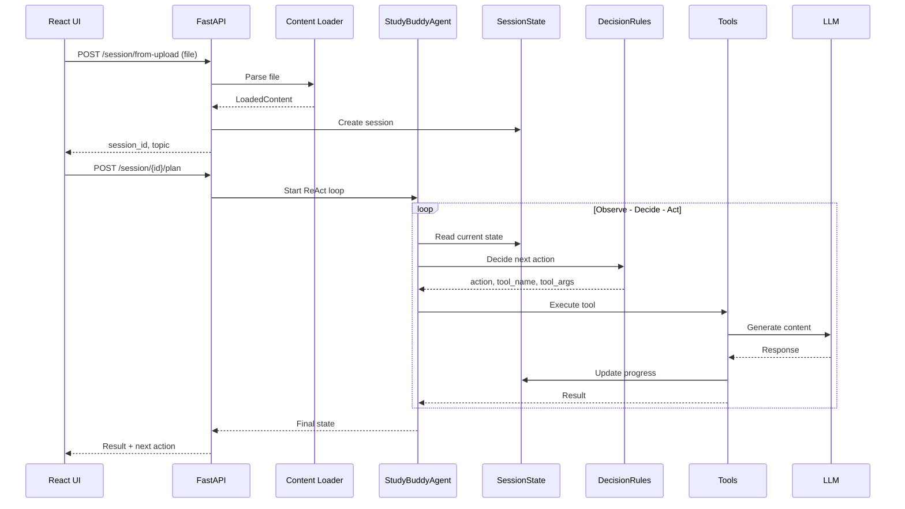
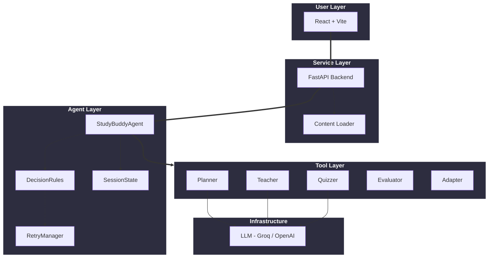
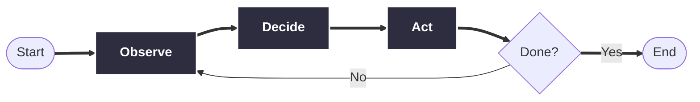

# System Architecture

## Overview

The system has three layers: a web interface, an agent core, and a set of tools. The web layer handles file uploads and session management. The agent core runs a ReAct loop that observes session state, decides the next action using rule-based logic, and executes it through one of five tools. Each tool updates session state after execution.

All decision-making about _what to do next_ uses explicit rules (DecisionRules), not LLM inference. The LLM is only used for content generation within tools (planning, teaching, quiz generation).

## Components

### Web Layer

**FastAPI Backend** (`webapi/main.py`)
- In-memory session management keyed by UUID.
- File upload parsing via Content Loader.
- Topic auto-suggestion from uploaded content.
- Next-action recommendation after each step.
- Error classification for user-facing messages.

**Content Loader** (`agent/utils/content_loader.py`)
- Parses `.txt`, `.md`, `.json`, `.pdf` into structured `LoadedContent`.
- Markdown heading-based section splitting.
- JSON key-value and nested structure parsing.
- File validation (existence, extension, size).

**React Frontend** (`webui/`)
- Upload-first interface built with React and Vite.
- Components: UploadStep, PlanStep, TeachStep, QuizStep, ModeSwitcher, SessionControls, QuizProgressTracker, MaterialPreview, SourcePreviewModal.
- Flow: upload file, create session, plan, teach, quiz, evaluate.

### Agent Core

**StudyBuddyAgent** (`agent/core/agent.py`)
- Runs the ReAct loop using LCEL chains (observe, decide, act).
- Coordinates between LLM, state, decision rules, and tools.
- Enforces iteration limits. Tracks session history.

**StudySessionState** (`agent/core/state.py`)
- Pydantic model tracking session metadata, concepts, and progress.
- ConceptProgress tracks individual concept status, quiz scores, retry counts, and difficulty.
- Methods: `get_progress_percentage()`, `get_average_score()`, `get_concepts_needing_retry()`.

**DecisionRules** (`agent/core/decision_rules.py`)
- Determines the next action using explicit if/then logic.
- Considers: concepts taught, quizzed, retry needs, scores.
- Returns structured decisions with tool name and arguments.

**RetryManager** (`agent/core/retry_manager.py`)
- Tracks retry counts per concept (max 3).
- Selects retry strategy based on attempt number: simplify, alternative approach, adapt difficulty.
- Prevents infinite retry loops.

**QuizWorkflow** (`agent/core/quiz_workflow.py`)
- Orchestrates quiz generation, answer evaluation, and state updates.
- Tracks quiz status and retry eligibility per concept.

**ToolExecutor** (`agent/core/tool_executor.py`)
- Binds tools to LLM using `llm.bind_tools()`.
- Extracts and executes tool calls from LLM responses.
- Updates state automatically after each tool execution.

### Tools

All tools live in `agent/tools/`. Each accepts structured input and returns structured output.

| Tool | File | Responsibility |
|------|------|----------------|
| Planner | `planner_tool.py` | Break topic into ordered concepts with difficulty levels |
| Teacher | `teacher_tool.py` | Generate explanations adapted to difficulty, with retry support |
| Quizzer | `quizzer_tool.py` | Generate multiple-choice questions from concept content |
| Evaluator | `evaluator_tool.py` | Score answers using keyword matching (not LLM judgment) |
| Adapter | `adapter_tool.py` | Adjust difficulty based on quiz scores and retry count |

### LCEL Chains

**Decision Chain** (`agent/chains/decision_chain.py`)
- Composes the ReAct loop as: `observe_chain | decide_chain | act_chain`.
- Each chain is a `RunnablePassthrough` that adds its result to the state dict.

### LLM Client

**LLM Client** (`agent/utils/llm_client.py`)
- Supports Groq (default) and OpenAI.
- Configured via environment variables.

## Data Flow


```mermaid
sequenceDiagram
    participant UI as React UI
    participant API as FastAPI
    participant CL as Content Loader
    participant Agent as StudyBuddyAgent
    participant State as SessionState
    participant Rules as DecisionRules
    participant Tools as Tools
    participant LLM as LLM

    UI->>API: POST /session/from-upload (file)
    API->>CL: Parse file
    CL-->>API: LoadedContent
    API->>State: Create session
    API-->>UI: session_id, topic

    UI->>API: POST /session/{id}/plan
    API->>Agent: Start ReAct loop

    loop Observe - Decide - Act
        Agent->>State: Read current state
        Agent->>Rules: Decide next action
        Rules-->>Agent: action, tool_name, tool_args
        Agent->>Tools: Execute tool
        Tools->>LLM: Generate content
        LLM-->>Tools: Response
        Tools->>State: Update progress
        Tools-->>Agent: Result
    end

    Agent-->>API: Final state
    API-->>UI: Result + next action
```

## Architecture Diagram


```mermaid
flowchart TD
    classDef layer fill:#2D2D3F,stroke:#FFFFFF,stroke-width:2px,color:#FFFFFF,font-weight:bold

    subgraph UserLayer[User Layer]
        direction TB
        Browser[React + Vite]
    end

    subgraph ServiceLayer[Service Layer]
        direction TB
        API[FastAPI Backend]
        CL[Content Loader]
    end

    subgraph AgentLayer[Agent Layer]
        direction TB
        SA[StudyBuddyAgent]
        DR[DecisionRules]
        RM[RetryManager]
        SM[SessionState]
    end

    subgraph ToolLayer[Tool Layer]
        direction TB
        PT[Planner]
        TT[Teacher]
        QT[Quizzer]
        ET[Evaluator]
        AT[Adapter]
    end

    subgraph InfraLayer[Infrastructure]
        direction TB
        LLM[LLM - Groq / OpenAI]
    end

    Browser ==> API
    API --> CL
    API ==> SA
    SA --> DR
    SA --> SM
    DR -.-> RM
    SA ==> ToolLayer
    PT --> LLM
    TT --> LLM
    QT --> LLM

    class UserLayer,ServiceLayer,AgentLayer,ToolLayer,InfraLayer layer
```

## ReAct Loop

The agent runs a loop with three phases per iteration:

1. **Observe** - Read current session state (concepts planned, taught, quizzed, scores).
2. **Decide** - DecisionRules analyzes state and returns the next action using explicit logic.
3. **Act** - ToolExecutor runs the selected tool and updates state.

The loop continues until all concepts are mastered or the iteration limit is reached.


```mermaid
flowchart LR
    classDef phase fill:#2D2D3F,stroke:#FFFFFF,stroke-width:2px,color:#FFFFFF,font-weight:bold

    Start([Start]) ==> Observe[Observe]
    Observe ==> Decide[Decide]
    Decide ==> Act[Act]
    Act ==> Check{Done?}
    Check -->|No| Observe
    Check ==>|Yes| End([End])

    class Observe,Decide,Act phase
```

## Design Decisions

- **Rule-based decisions over LLM decisions.** DecisionRules uses explicit if/then logic to determine the next action. This makes behavior predictable and testable. The LLM is only used for content generation.

- **State-driven flow.** The agent does not maintain a conversation history for decision-making. It reads the current state each iteration. This avoids context window issues and makes the system stateless between iterations.

- **Explicit scoring.** The Evaluator uses keyword matching, not LLM judgment. This ensures consistent, reproducible quiz scores.

- **Retry with strategy variation.** Each retry attempt uses a different teaching strategy (simplify, alternative approach, difficulty adaptation). After 3 retries, the system adapts difficulty and moves on.

- **LCEL composition.** The ReAct loop is composed as a chain (`observe | decide | act`). This keeps each phase isolated and testable.

## Environment Configuration

```
LLM_PROVIDER=groq
LLM_MODEL=llama-3.1-8b-instant
LLM_TEMPERATURE=0.7
GROQ_API_KEY=your_key
OPENAI_API_KEY=optional
```

## API Reference

| Method | Path | Description |
|--------|------|-------------|
| `GET` | `/` | Health check |
| `GET` | `/ping` | Liveness probe |
| `POST` | `/upload` | Upload and parse a file |
| `POST` | `/session/from-upload` | Upload file, create session |
| `POST` | `/session` | Create session from uploaded content |
| `GET` | `/session/{id}` | Get session state |
| `POST` | `/session/{id}/plan` | Generate learning path |
| `POST` | `/session/{id}/teach` | Teach a concept |
| `POST` | `/session/{id}/quiz` | Generate a quiz |
| `POST` | `/session/{id}/evaluate` | Evaluate quiz answers |
| `GET` | `/session/{id}/next-action` | Recommended next step |


