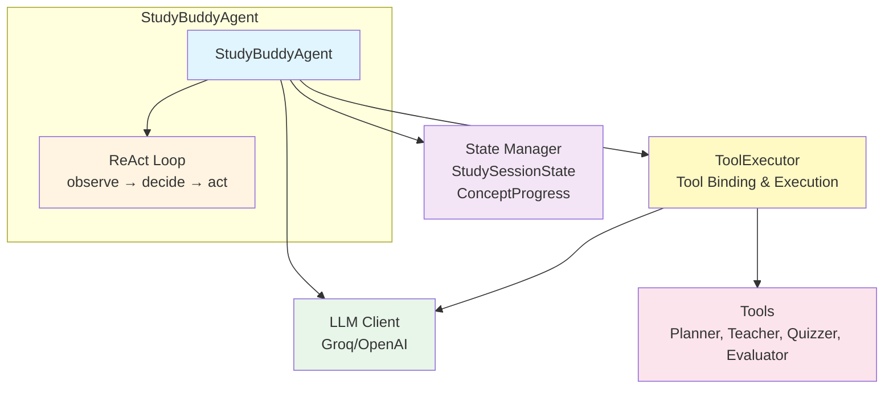
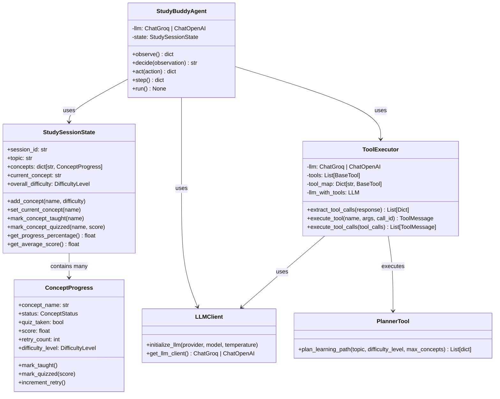
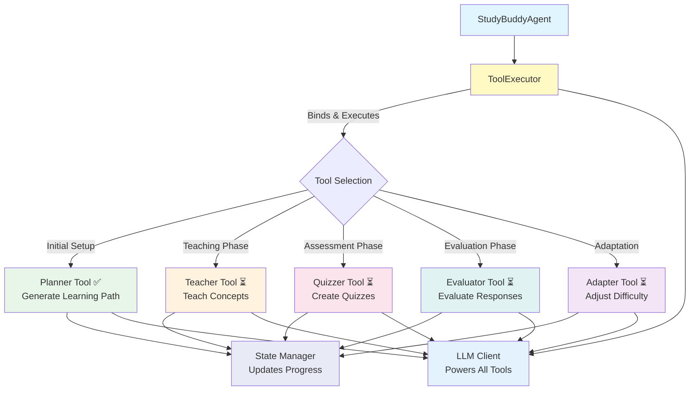
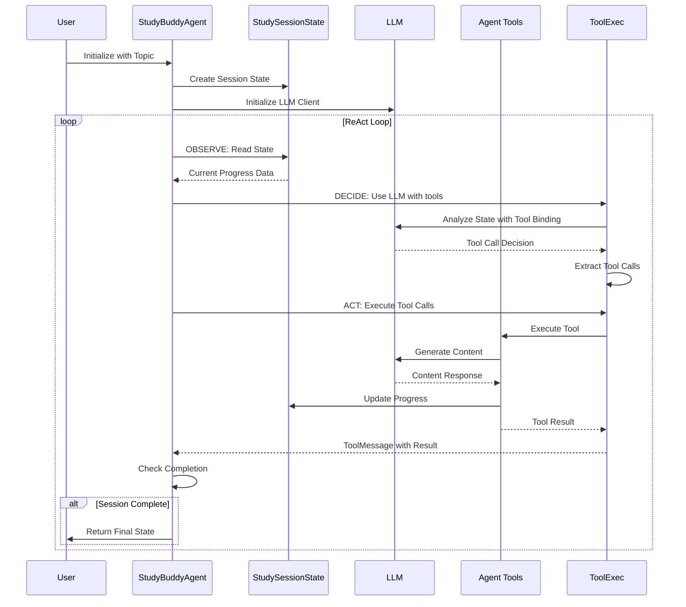

# EZ Agentic Study Buddy - Architecture

## System Overview



## Component Architecture



### Core Components

#### 1. StudyBuddyAgent (`agent/core/agent.py`)
- **Role**: Main orchestrator
- **Responsibilities**:
  - Manages ReAct loop (observe → decide → act)
  - Coordinates between LLM and state
  - Executes learning flow

#### 2. State Management (`agent/core/state.py`)
- **StudySessionState**: Overall session tracking
  - Session metadata (topic, ID, start time)
  - Dictionary of concepts and their progress
  - Methods to query progress (taught, mastered, needs retry)
  
- **ConceptProgress**: Individual concept tracking
  - Status (not_started, in_progress, taught, quizzed, mastered, needs_retry)
  - Quiz scores and retry counts
  - Difficulty level

#### 3. LLM Client (`agent/utils/llm_client.py`)
- **Role**: Language model interface
- **Supports**: Groq (default, free) and OpenAI
- **Configuration**: Environment variables (.env)

#### 4. ToolExecutor (`agent/core/tool_executor.py`)
- **Role**: Manages tool binding and execution
- **Responsibilities**:
  - Binds tools to LLM using `llm.bind_tools()`
  - Extracts tool calls from LLM responses
  - Executes tools and creates ToolMessages
  - Maps tool names to tool instances

#### 5. Tools (`agent/tools/`)
- **Planner Tool** (`planner_tool.py`): ✅ Implemented
  - Breaks down topics into ordered learning concepts
  - Returns structured concept list with difficulty and order
- **Teacher Tool**: ⏳ Planned
- **Quizzer Tool**: ⏳ Planned
- **Evaluator Tool**: ⏳ Planned

## ReAct Pattern Flow


## Tool Integration



## Data Flow



## Key Design Patterns

1. **ReAct Pattern**: Reasoning + Acting loop for autonomous decision-making
2. **State Management**: Centralized state tracking with Pydantic models
3. **Dependency Injection**: LLM and state can be provided or auto-created
4. **Tool-Based Architecture**: Extensible tool system with ToolExecutor managing tool binding and execution
5. **Manual Tool Calling**: Agent manually extracts and executes tool calls from LLM responses (not using AgentExecutor)

## Environment Configuration

```
.env file:
├─> LLM_PROVIDER=groq
├─> LLM_MODEL=llama-3.1-8b-instant
├─> GROQ_API_KEY=your_key
└─> (Optional: OPENAI_API_KEY)
```


