# EZ Agentic Study Buddy - Architecture

## System Overview

```mermaid
graph TB
    subgraph "StudyBuddyAgent"
        Agent[StudyBuddyAgent]
        ReAct[ReAct Loop<br/>observe → decide → act]
        Agent --> ReAct
    end
    
    LLM[LLM Client<br/>Groq/OpenAI]
    State[State Manager<br/>StudySessionState<br/>ConceptProgress]
    ToolExec[ToolExecutor<br/>Tool Binding & Execution]
    Tools[Tools<br/>Planner ✅, Teacher ✅, Quizzer ✅, Evaluator ✅, Adapter ✅]
    
    Agent --> LLM
    Agent --> State
    Agent --> ToolExec
    ToolExec --> LLM
    ToolExec --> Tools
    
    style Agent fill:#e1f5ff
    style ReAct fill:#fff4e1
    style LLM fill:#e8f5e9
    style State fill:#f3e5f5
    style ToolExec fill:#fff9c4
    style Tools fill:#fce4ec
```



## Component Architecture


### Core Components

#### 1. StudyBuddyAgent (`agent/core/agent.py`)
- **Role**: Main orchestrator
- **Responsibilities**:
  - Manages ReAct loop using LCEL chains (observe → decide → act)
  - Coordinates between LLM, state, decision rules, and tools
  - Executes learning flow with iteration limits
  - Tracks session history and completion status

#### 2. State Management (`agent/core/state.py`)
- **StudySessionState**: Overall session tracking
  - Session metadata (topic, ID, start time)
  - Dictionary of concepts and their progress
  - Methods to query progress (taught, mastered, needs retry)
  
- **ConceptProgress**: Individual concept tracking
  - Status (not_started, in_progress, taught, quizzed, mastered, needs_retry)
  - Quiz scores and retry counts
  - Difficulty level

#### 3. LLM Client (`agent/utils/llm_client.py`)
- **Role**: Language model interface
- **Supports**: Groq (default, free) and OpenAI
- **Configuration**: Environment variables (.env)

#### 4. DecisionRules (`agent/core/decision_rules.py`)
- **Role**: Rule-based decision making for autonomous actions
- **Responsibilities**:
  - Analyzes current state to determine next action
  - Uses explicit if/then logic (not LLM-based decisions)
  - Considers concepts taught, quizzed, retry needs, scores
  - Returns structured decisions with tool information
  - Integrates with RetryManager for retry strategies

#### 5. RetryManager (`agent/core/retry_manager.py`)
- **Role**: Manages retry logic and alternative teaching strategies
- **Responsibilities**:
  - Tracks retry counts (MAX_RETRIES = 3)
  - Determines retry strategies based on attempt number
  - Generates context for re-teaching
  - Handles difficulty adaptation after max retries
  - Prevents infinite retry loops

#### 6. QuizWorkflow (`agent/core/quiz_workflow.py`)
- **Role**: Orchestrates quiz generation and evaluation workflow
- **Responsibilities**:
  - Generates quizzes for concepts
  - Evaluates learner answers
  - Updates state with quiz scores
  - Provides complete quiz flow (generate → evaluate → update)
  - Tracks quiz status and retry eligibility

#### 7. ToolExecutor (`agent/core/tool_executor.py`)
- **Role**: Manages tool binding and execution with state integration
- **Responsibilities**:
  - Binds tools to LLM using `llm.bind_tools()`
  - Extracts tool calls from LLM responses
  - Executes tools and creates ToolMessages
  - Maps tool names to tool instances
  - Automatically updates state after tool execution
  - Maintains state consistency across tool calls
  - Integrates with RetryManager for quiz evaluation

#### 8. Tools (`agent/tools/`)
- **Planner Tool** (`planner_tool.py`): ✅ Implemented
  - Breaks down topics into ordered learning concepts
  - Returns structured concept list with difficulty and order
  - Updates state: adds concepts to StudySessionState
- **Teacher Tool** (`teacher_tool.py`): ✅ Implemented
  - Generates explanations at appropriate difficulty levels
  - Adapts vocabulary, examples, and depth based on difficulty
  - Supports retry attempts with alternative strategies
  - Returns structured teaching content
  - Updates state: marks concepts as taught
- **Quizzer Tool** (`quizzer_tool.py`): ✅ Implemented
  - Generates quizzes based on concept and difficulty
  - Supports multiple question types (multiple choice, short answer, true/false)
  - Returns structured JSON with questions, options, answers, explanations
  - Updates state: adds concepts if not present
- **Evaluator Tool** (`evaluator_tool.py`): ✅ Implemented
  - Evaluates learner responses using explicit, rule-based scoring
  - Handles multiple question types with keyword matching
  - Provides partial credit for partial answers
  - Returns scores, feedback, and detailed results
  - Updates state: marks concepts as quizzed with scores
- **Adapter Tool** (`adapter_tool.py`): ✅ Implemented
  - Adjusts difficulty level based on performance metrics
  - Analyzes quiz scores, retry counts, average scores
  - Uses explicit rules (not LLM judgment)
  - Handles edge cases (min/max difficulty boundaries)
  - Updates state: adjusts concept difficulty level

#### 9. LCEL Chains (`agent/chains/decision_chain.py`)
- **Role**: Declarative chain composition for ReAct loop
- **Components**:
  - `create_observe_chain()`: Observes current state
  - `create_decide_chain()`: Makes decisions based on state
  - `create_act_chain()`: Executes actions using tools
  - `create_step_chain()`: Composes all chains together
- **Benefits**:
  - Cleaner, more declarative code
  - Better separation of concerns
  - Easier to test and maintain
  - Composable with pipe operator (|)

## ReAct Pattern Flow


## Tool Integration

```mermaid
graph TD
    Agent[StudyBuddyAgent] --> ToolExec[ToolExecutor]
    
    ToolExec -->|Binds & Executes| Tools{Tool Selection}
    
    Tools -->|Initial Setup| Planner[Planner Tool ✅<br/>Generate Learning Path]
    Tools -->|Teaching Phase| Teacher[Teacher Tool ✅<br/>Teach Concepts<br/>with Retry Support]
    Tools -->|Assessment Phase| Quizzer[Quizzer Tool ✅<br/>Create Quizzes]
    Tools -->|Evaluation Phase| Evaluator[Evaluator Tool ✅<br/>Evaluate Responses<br/>Explicit Scoring]
    Tools -->|Adaptation| Adapter[Adapter Tool ✅<br/>Adjust Difficulty<br/>Based on Performance]
    
    Planner --> State
    Teacher --> State
    Quizzer --> State
    Evaluator --> State
    Adapter --> State
    
    State[State Manager<br/>Updates Progress]
    
    LLM[LLM Client<br/>Powers All Tools]
    
    ToolExec --> LLM
    Planner --> LLM
    Teacher --> LLM
    Quizzer --> LLM
    Evaluator --> LLM
    Adapter --> LLM
    
    style Agent fill:#e1f5ff
    style ToolExec fill:#fff9c4
    style Planner fill:#e8f5e9
    style Teacher fill:#fff3e0
    style Quizzer fill:#fce4ec
    style Evaluator fill:#e0f2f1
    style Adapter fill:#f3e5f5
    style LLM fill:#e3f2fd
    style State fill:#e8eaf6
```



## Data Flow


## Key Design Patterns

1. **ReAct Pattern**: Reasoning + Acting loop for autonomous decision-making
   - Observe → Decide → Act → Repeat until completion
   - Implemented using LCEL chains for cleaner composition

2. **State Management**: Centralized state tracking with Pydantic models
   - StudySessionState for overall session tracking
   - ConceptProgress for individual concept status
   - Automatic state updates after tool execution

3. **Rule-Based Decisions**: Explicit if/then logic for decision making
   - DecisionRules class analyzes state and returns actions
   - Not LLM-based decisions (uses explicit rules)
   - Considers taught status, quiz scores, retry counts

4. **Retry Mechanisms**: Adaptive retry with alternative strategies
   - MAX_RETRIES = 3 limit prevents infinite loops
   - Different strategies per retry attempt (simplify, alternative approach, adapt difficulty)
   - Automatic difficulty adaptation after max retries

5. **LCEL Chains**: LangChain Expression Language for declarative composition
   - RunnablePassthrough for state management
   - Pipe operator (|) for chain composition
   - Better separation of concerns and testability

6. **Dependency Injection**: LLM and state can be provided or auto-created
   - Flexible initialization with optional parameters
   - Easy testing with mock objects

7. **Tool-Based Architecture**: Extensible tool system with ToolExecutor
   - Planner, Teacher, Quizzer, Evaluator, Adapter tools
   - Automatic tool binding to LLM
   - State updates after tool execution

8. **Explicit Scoring**: Rule-based evaluation logic
   - EvaluatorTool uses explicit keyword matching, not LLM judgment
   - Consistent, predictable scoring
   - Supports partial credit scenarios

9. **Error Handling**: Comprehensive error handling with clear messages
   - Input validation with helpful error messages
   - Structured error responses in action results
   - Edge case handling throughout the system

## LCEL Chain Architecture


**Chain Composition**:
```python
step_chain = (
    observe_chain
    | decide_chain
    | act_chain
)
```

## Current Status

### ✅ Implemented Components

- **Core Agent**: StudyBuddyAgent with ReAct loop using LCEL chains
- **State Management**: Complete state tracking with Pydantic models
- **Decision Rules**: Rule-based decision making with explicit logic
- **Retry Manager**: Retry mechanisms with alternative strategies
- **Quiz Workflow**: Complete quiz generation and evaluation workflow
- **All Tools**: Planner, Teacher, Quizzer, Evaluator, Adapter
- **LCEL Chains**: Declarative chain composition for ReAct loop
- **Error Handling**: Comprehensive error handling and edge cases
- **Testing**: End-to-end tests and edge case validation

### 🔄 Learning Flow

1. **Planning Phase**: Planner tool creates learning path
2. **Teaching Phase**: Teacher tool explains concepts (with retry support)
3. **Assessment Phase**: Quizzer tool generates quizzes
4. **Evaluation Phase**: Evaluator tool scores responses (explicit logic)
5. **Adaptation Phase**: Adapter tool adjusts difficulty based on performance
6. **Retry Phase**: RetryManager handles retries with alternative strategies

### 📊 State Tracking

- Concepts planned, taught, quizzed, mastered
- Quiz scores and retry counts
- Difficulty levels and adaptation history
- Progress percentage and average scores
- Session history and iteration tracking

## Environment Configuration

```
.env file:
├─> LLM_PROVIDER=groq
├─> LLM_MODEL=llama-3.1-8b-instant
├─> LLM_TEMPERATURE=0.7
├─> GROQ_API_KEY=your_key
└─> (Optional: OPENAI_API_KEY)
```


