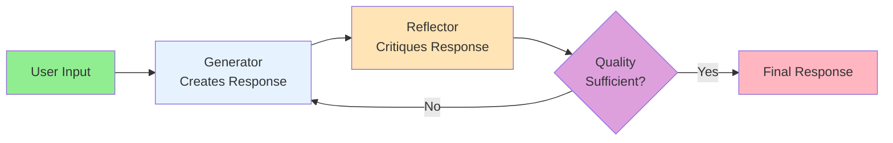
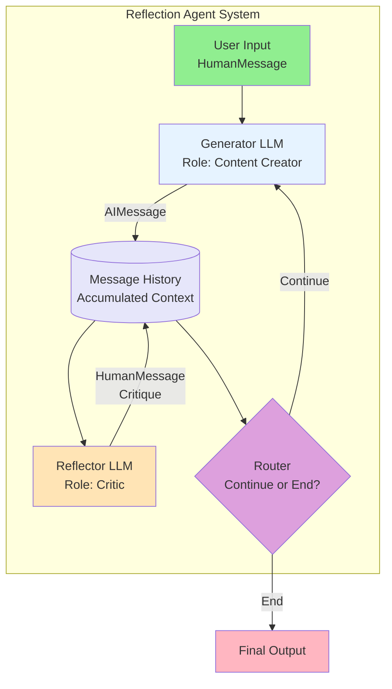
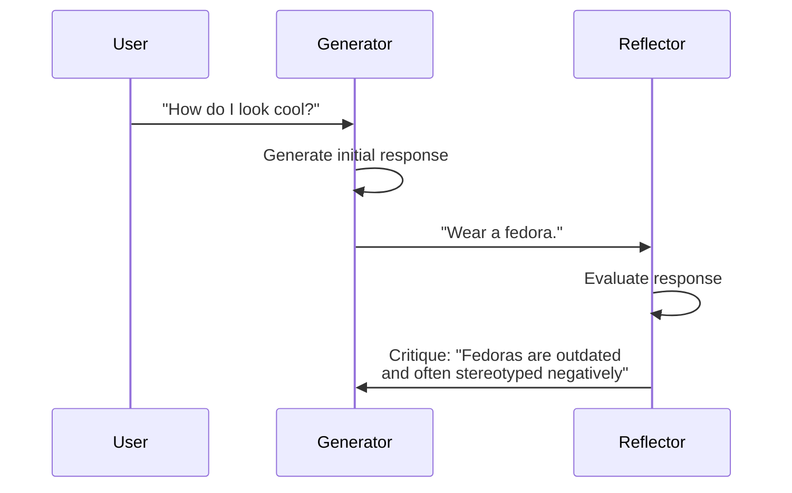
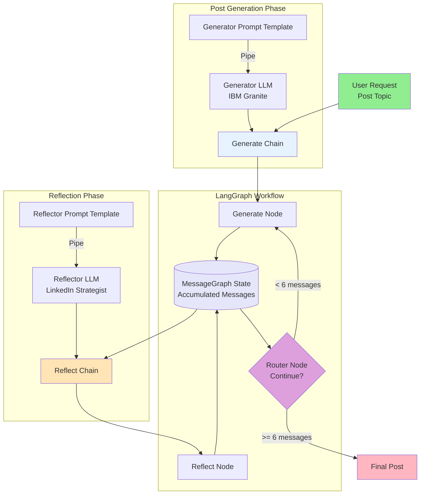
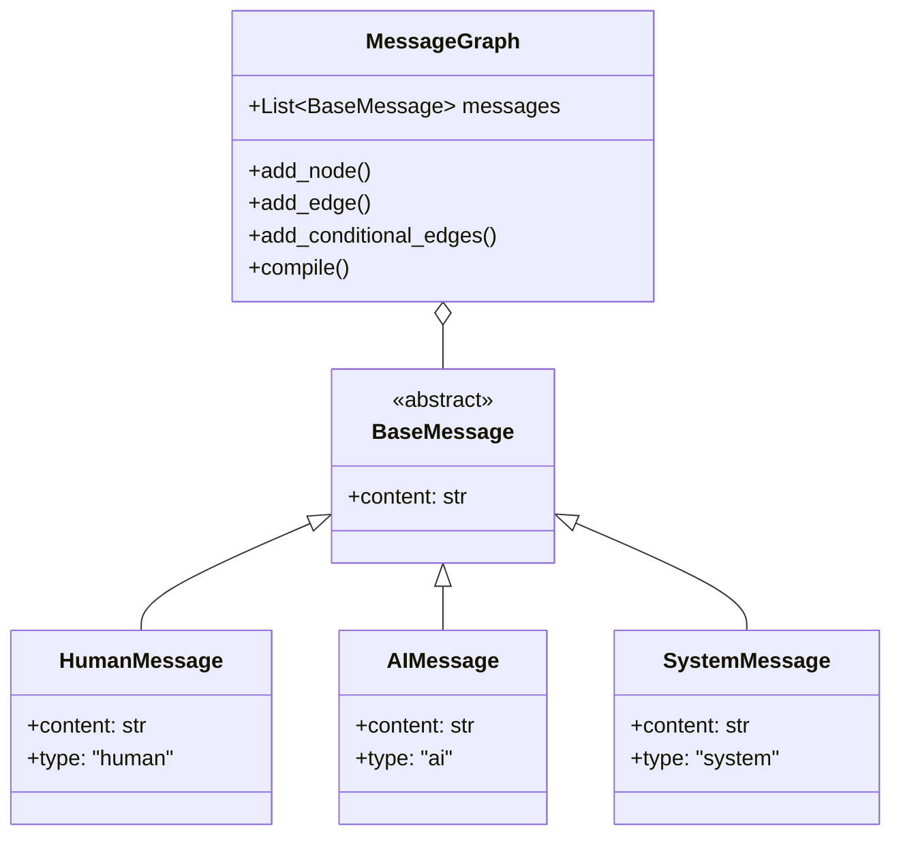
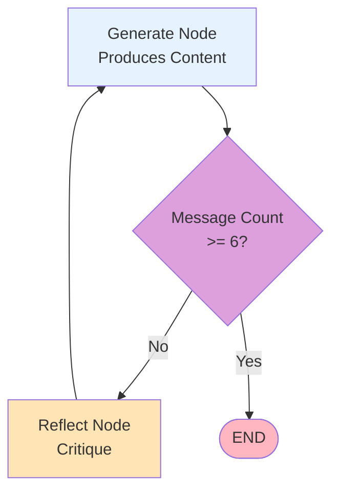
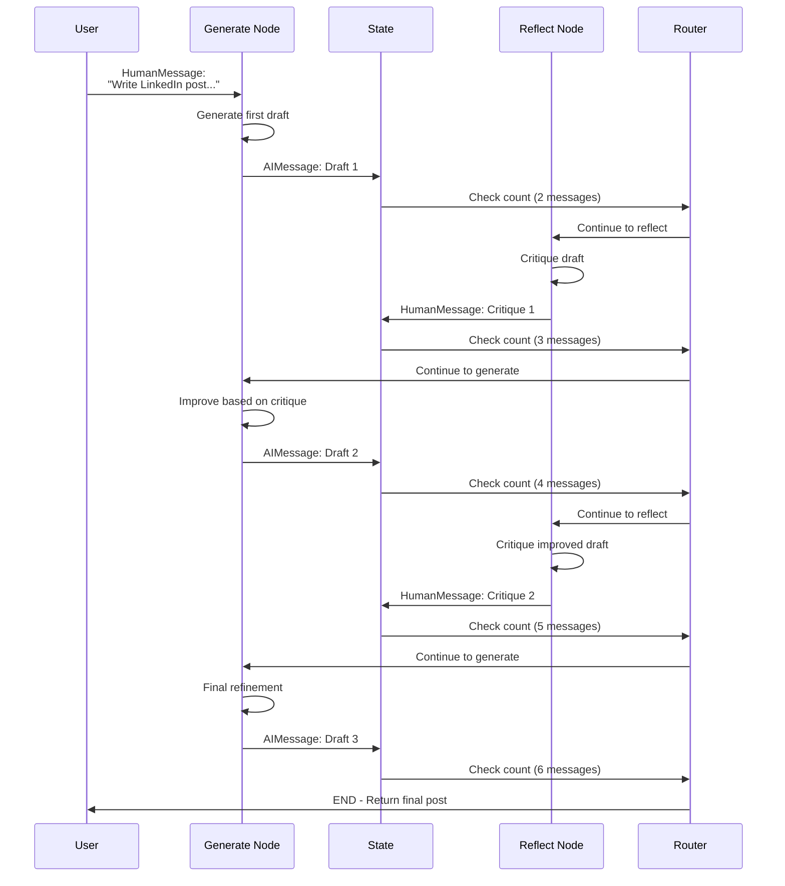
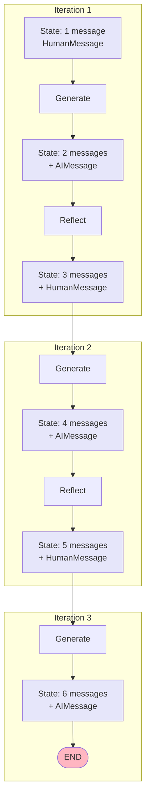
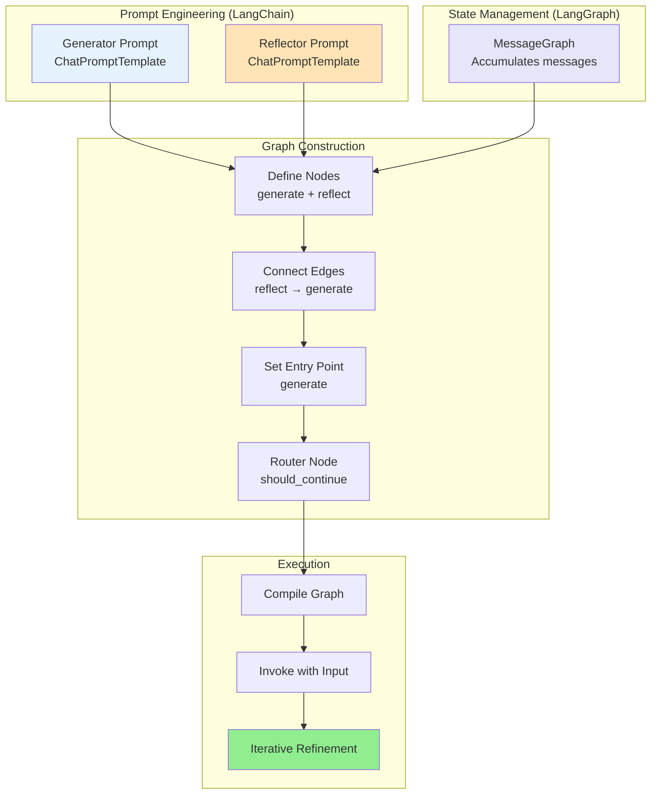

# The Art of AI Self-Improvement: Building Reflection Agents

**A comprehensive guide to building AI agents that iteratively improve their own outputs through self-critique and refinement**

---

## Table of Contents
1. Introduction
2. What Are Reflection Agents?
3. Types of Reflection Agents
4. Basic Reflection Agent Architecture
5. The Generator-Reflector Loop
6. Building a LinkedIn Post Optimization Agent
7. Implementation with LangChain and LangGraph
8. Workflow Execution
9. Best Practices
10. Summary

---

## Introduction

Imagine an AI that improves by learning from its own mistakes. This is the core concept of **reflection agents** - AI systems designed to analyze their own performance and enhance their strategies through critical self-evaluation.

### Key Concept

Reflection agents use an **iterative feedback loop** where:
1. An AI generates initial output
2. Another AI (or the same one in a different role) critiques that output
3. The generator uses the critique to improve
4. The cycle repeats until quality standards are met

---

## What Are Reflection Agents?

### Definition

**Reflection agents** are AI systems that iteratively improve outputs by critically analyzing their own performance through a feedback loop.

### Core Mechanism



### Two Primary Roles

| Role | Function | Input | Output |
|------|----------|-------|--------|
| **Generator** | Produces content | User prompt + previous feedback | Initial or improved response |
| **Reflector** | Provides critical feedback | Generated content + context | Critique and suggestions |

---

## Types of Reflection Agents

### Overview

Reflection agents primarily fall into three types:

| Type | Complexity | Key Feature |
|------|------------|-------------|
| **Basic Reflection Agent** | Simple | Generator-reflector loop with fixed iterations |
| **Reflexion Agent** | Moderate | Uses episodic memory and self-reflection |
| **Language Agent Tree Search (LATS)** | Advanced | Explores multiple solution paths using tree search |

**This guide focuses on Basic Reflection Agents.**

---

## Basic Reflection Agent Architecture

### High-Level Architecture



### Key Components

**1. Generator LLM**
- Accesses the original user message
- Produces initial or improved output
- Accumulates context from previous iterations

**2. Reflector LLM**
- Evaluates generator's output
- Uses both the generated content and original message
- Provides constructive critique

**3. Message History (Memory)**
- Accumulates all messages across iterations
- Builds context over time
- Enables continuous improvement

**4. Router**
- Controls workflow continuation
- Decides when quality is sufficient
- Terminates loop after max iterations

---

## The Generator-Reflector Loop

### Example: "How Do I Look Cool?"

Let's walk through a complete reflection cycle:

#### Initial State



#### Iteration 1

**Generator Output:**
```
"Wear a fedora."
```

**Reflector Critique:**
```
"Fedoras are outdated and often stereotyped negatively. 
This advice could harm credibility. Suggest more timeless, 
authentic approaches to style."
```

#### Iteration 2

**Generator Improved Response:**
```
"Wear well-fitted clothes, have good posture, and be confident. 
Authenticity beats trying to look cool."
```

**Reflector Evaluation:**
```
"Good advice focused on authenticity rather than specific items. 
Could add something about personal style to make it more actionable."
```

#### Final Output

**Generator Final Response:**
```
"Find clothes that match your personal style, maintain good posture, 
and be confident. True coolness comes from authenticity, not following trends."
```

### Complete Cycle Visualization

```mermaid
stateDiagram-v2
    [*] --> Iteration1: User: "How do I look cool?"
    
    Iteration1 --> Review1: Gen: "Wear a fedora"
    Review1 --> Iteration2: Ref: "Outdated, stereotyped"
    
    Iteration2 --> Review2: Gen: "Well-fitted clothes,<br/>good posture, confidence"
    Review2 --> Iteration3: Ref: "Good, add personal style"
    
    Iteration3 --> Final: Gen: "Match personal style,<br/>posture, confidence"
    Final --> [*]: Quality Sufficient
    
    note right of Iteration1: Crisis detected:<br/>Fedora suggestion!
    note right of Final: Crisis averted:<br/>Flawless vibes!
```

### Memory Accumulation

| Iteration | Messages in State | Context Size |
|-----------|-------------------|--------------|
| 0 | HumanMessage: "How do I look cool?" | 1 |
| 1 | + AIMessage: "Wear a fedora." | 2 |
| 1 | + HumanMessage: "Fedoras are outdated..." | 3 |
| 2 | + AIMessage: "Wear well-fitted clothes..." | 4 |
| 2 | + HumanMessage: "Good advice, add style..." | 5 |
| 3 | + AIMessage: "Find clothes matching style..." | 6 |

---

## Building a LinkedIn Post Optimization Agent

### Use Case

Build an agent that:
1. Generates a LinkedIn post
2. Critiques its own output
3. Refines content iteratively
4. Ensures higher quality through multiple cycles

### System Architecture



---

## Implementation with LangChain and LangGraph

### Step 1: Initialize the LLM

```python
from langchain_ibm import WatsonxLLM

# Initialize IBM's Granite model
llm = WatsonxLLM(
    model_id="ibm/granite-13b-chat-v2",
    # ... configuration
)
```

### Step 2: Create Generator Prompt

```python
from langchain.prompts import ChatPromptTemplate, MessagesPlaceholder

# Define generator prompt
generate_prompt = ChatPromptTemplate.from_messages([
    ("system", "You are a professional content creator. "
               "Generate engaging, concise content based on user requests."),
    MessagesPlaceholder(variable_name="messages"),  # Memory
])

# Create generation chain
generate_chain = generate_prompt | llm
```

**Key Components:**
- **SystemMessage**: Defines LLM's role
- **MessagesPlaceholder**: Maintains user inputs and history
- **Pipe operator (`|`)**: Connects prompt to LLM

### Step 3: Create Reflector Prompt

```python
# Define reflection prompt
reflect_prompt = ChatPromptTemplate.from_messages([
    ("system", "You are a professional LinkedIn content strategist. "
               "Critically evaluate the generated post and provide "
               "constructive feedback for improvement."),
    MessagesPlaceholder(variable_name="messages"),  # Includes post to critique
])

# Create reflection chain
reflect_chain = reflect_prompt | llm
```

### Step 4: Define Agent State with MessageGraph

```python
from langgraph.graph import MessageGraph

# MessageGraph is a specialized StateGraph
# State holds only an array of messages:
# - HumanMessage
# - AIMessage  
# - SystemMessage

graph = MessageGraph()
```

**What is MessageGraph?**
- Specialized state graph that accumulates different message types
- Each user turn adds HumanMessage followed by AIMessage
- Automatically handles message appending and state updates



### Step 5: Build Generate Node

```python
from langchain_core.messages import BaseMessage, HumanMessage, AIMessage
from typing import List, Sequence

def generation_node(state: List[BaseMessage]) -> List[BaseMessage]:
    """
    Generate or improve content based on conversation history.
    
    Args:
        state: List of messages including original HumanMessage
               and any previous feedback
    
    Returns:
        List containing new AIMessage with generated content
    """
    # Pass state (message history) to generation chain
    response = generate_chain.invoke({"messages": state})
    
    # Wrap output in AIMessage
    return [AIMessage(content=response.content)]
```

**How it works:**
1. Takes `state` variable as input (e.g., "Make me look cool on LinkedIn")
2. Input messages passed to `invoke` function
3. Chain generates response using context
4. Returns output wrapped in `AIMessage`
5. LangGraph implicitly updates state by appending the AIMessage

### Step 6: Build Reflection Node

```python
def reflection_node(state: List[BaseMessage]) -> List[BaseMessage]:
    """
    Critique the AI-generated response.
    
    Args:
        state: Sequence of all messages including latest AI output
    
    Returns:
        List containing HumanMessage with critique
    """
    # Pass conversation context to reflection chain
    critique = reflect_chain.invoke({"messages": state})
    
    # Wrap critique as HumanMessage (not AIMessage!)
    # This makes reflector "speak to" generator as a user
    return [HumanMessage(content=critique.content)]
```

**Why HumanMessage?**
- `generation_node` expects human input
- Returning `AIMessage` would break the feedback loop
- By using `HumanMessage`, reflector acts as a user requesting refinement

### Step 7: Add Nodes to Graph

```python
# Add generate node
graph.add_node("generate", generation_node)

# Add reflect node
graph.add_node("reflect", reflection_node)
```

**Note:** Node names can differ from function names.

### Step 8: Define Edges

```python
# Create one-way connection from reflection back to generation
graph.add_edge("reflect", "generate")
```

### Step 9: Set Entry Point

```python
# Start workflow with generation node
graph.set_entry_point("generate")
```

This begins with the initial response based on user input.

### Step 10: Add Router Logic

```python
from langgraph.graph import END

def should_continue(state: List[BaseMessage]) -> str:
    """
    Control workflow continuation.
    
    Args:
        state: Current message history
    
    Returns:
        "reflect" to continue loop, or END to terminate
    """
    # Check message count
    if len(state) >= 6:
        return END
    else:
        return "reflect"

# Add conditional routing from generate node
graph.add_conditional_edges(
    "generate",          # Source node
    should_continue,     # Decision function
    {
        "reflect": "reflect",
        END: END
    }
)
```

**Router Decision Logic:**



### Step 11: Compile the Workflow

```python
# Compile graph into runnable application
app = graph.compile()
```

### Step 12: Run the Agent

```python
from langchain_core.messages import HumanMessage

# Define initial user input
initial_message = HumanMessage(
    content="Write a LinkedIn post on getting a software developer job at IBM under 160 characters."
)

# Run workflow
response = app.invoke([initial_message])

# Extract final post
final_post = response[-1].content
print(final_post)
```

---

## Workflow Execution

### Complete Execution Flow



### Example Execution Output

#### Message History Progression

| Step | Message Type | Content | Total Messages |
|------|--------------|---------|----------------|
| 0 | HumanMessage | "Write LinkedIn post on getting IBM dev job <160 chars" | 1 |
| 1 | AIMessage | "Just landed at IBM! Excited to start my dev journey. #NewBeginnings" | 2 |
| 2 | HumanMessage | "Too generic. Add specific value. Mention skills or achievements." | 3 |
| 3 | AIMessage | "Joined IBM as Developer! Built 5+ apps in Python. Ready for innovation!" | 4 |
| 4 | HumanMessage | "Good improvement. Make it more engaging, add call to action." | 5 |
| 5 | AIMessage | "Thrilled to join IBM! 5+ Python apps built. Let's connect & innovate! 🚀" | 6 |

#### Final Output Structure

```python
response = [
    HumanMessage(content="Write LinkedIn post..."),
    AIMessage(content="Just landed at IBM..."),        # Draft 1
    HumanMessage(content="Too generic..."),             # Critique 1
    AIMessage(content="Joined IBM as Developer..."),    # Draft 2
    HumanMessage(content="Good improvement..."),        # Critique 2
    AIMessage(content="Thrilled to join IBM...")        # Final (Draft 3)
]

# Extract final post
final_post = response[-1].content
```

### State Evolution Visualization



---

## Best Practices

### 1. Prompt Engineering

**Generator Prompt Guidelines:**
- Clearly define role and expertise
- Specify output format and constraints
- Include examples if needed

**Reflector Prompt Guidelines:**
- Frame as expert critic or strategist
- Request specific, constructive feedback
- Focus on improvement, not just problems

### 2. Iteration Control

| Strategy | Description | Use Case |
|----------|-------------|----------|
| **Fixed Count** | Set maximum iterations (e.g., 6 messages) | Simple, predictable workflows |
| **Quality Threshold** | LLM evaluates quality score | Advanced quality control |
| **Hybrid** | Max iterations + quality check | Production systems |

### 3. Message Management

```python
# Good: Clear message types
def reflection_node(state):
    critique = reflect_chain.invoke({"messages": state})
    return [HumanMessage(content=critique.content)]  # Correct type

# Bad: Wrong message type
def reflection_node(state):
    critique = reflect_chain.invoke({"messages": state})
    return [AIMessage(content=critique.content)]  # Breaks loop!
```

### 4. State Optimization

**LangGraph's Automatic Merging:**
- Nodes return new messages
- LangGraph appends to state automatically
- No manual state management needed

### 5. Advanced Router Logic

```python
# Simple: Fixed iterations
def should_continue(state):
    return END if len(state) >= 6 else "reflect"

# Advanced: LLM-based decision
def should_continue_llm(state):
    last_message = state[-1].content
    decision = quality_llm.invoke(f"Is this good enough? {last_message}")
    return END if "yes" in decision.lower() else "reflect"
```

---

## Summary

### Key Concepts Learned

| Concept | Description |
|---------|-------------|
| **Reflection Agents** | Iteratively improve AI outputs through feedback loops |
| **Generator Role** | Produces content based on prompts and feedback |
| **Reflector Role** | Provides critical feedback for improvement |
| **LangChain Prompts** | Guide LLMs via ChatPromptTemplate and MessagesPlaceholder |
| **MessageGraph** | LangGraph state tracking conversation messages |
| **Node Functions** | Process state and return new messages |
| **Router Logic** | Control flow with conditional edges |

### Architecture Summary



### Benefits of Reflection Agents

1. **Quality Improvement**: Iterative refinement produces better outputs
2. **Self-Correction**: AI identifies and fixes its own mistakes
3. **Consistency**: Multiple iterations ensure thoroughness
4. **Flexibility**: Adaptable to various content generation tasks
5. **Transparency**: Clear feedback loop shows improvement process

### Limitations and Considerations

1. **Computational Cost**: Multiple LLM calls per request
2. **Time**: Slower than single-pass generation
3. **Prompt Quality**: Requires well-crafted prompts for both roles
4. **Diminishing Returns**: Too many iterations may not add value
5. **Dependency**: Quality depends on both generator and reflector

### When to Use Reflection Agents

**Good Use Cases:**
- Content creation requiring high quality
- Professional writing (LinkedIn, emails, reports)
- Code generation with review
- Creative writing with refinement

**Not Ideal For:**
- Simple queries needing quick responses
- Time-sensitive applications
- Low-stakes content generation

### Next Steps

1. Implement basic reflection agent
2. Experiment with different prompts
3. Add quality scoring mechanisms
4. Explore Reflexion and LATS agents
5. Build domain-specific reflection systems

Reflection agents represent a powerful paradigm in AI self-improvement, enabling systems that not only generate content but critically evaluate and enhance their own outputs through structured feedback loops.
