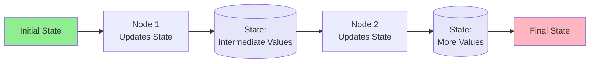
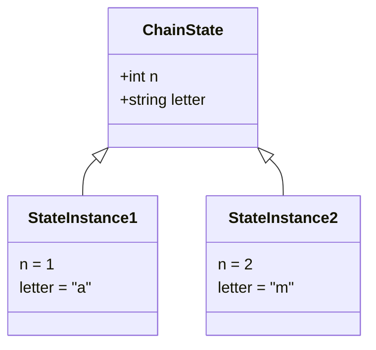
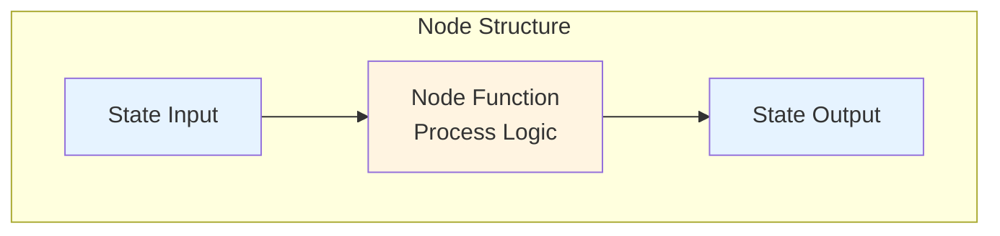
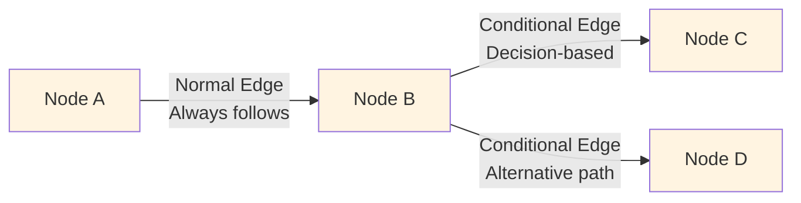
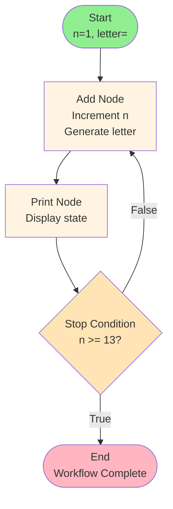
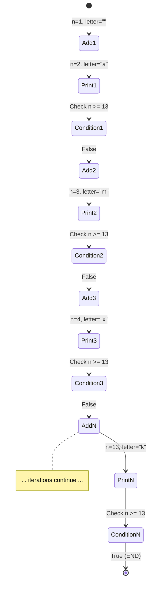
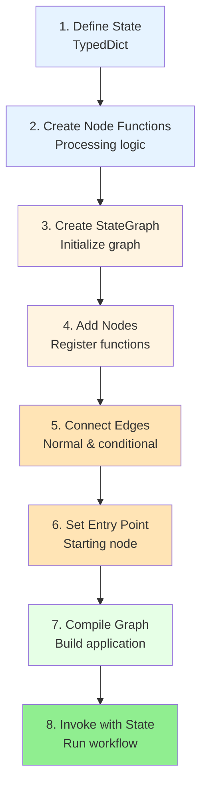

# Getting Started with LangGraph 101

**A hands-on guide to building your first LangGraph application and understanding core concepts**

---

## Table of Contents
1. Introduction
2. Understanding State in LangGraph
3. Building Blocks: Nodes and Edges
4. Building a Counter Application
5. Workflow Execution
6. Best Practices
7. Summary

---

## Introduction

LangGraph is a powerful framework for building **stateful, multi-agent applications**. This guide will walk you through building a simple counter application to understand the key components and concepts.

### What You'll Learn

- How LangGraph uses graphs to represent agent workflows
- Powerful capabilities: looping and conditional branching
- Building a complete LangGraph application
- Visualizing workflow execution and state progression

---

## Understanding State in LangGraph

### What is State?

State in LangGraph is a **complex, evolving memory structure** that holds:
- All graph inputs
- Intermediate values during processing
- Final outputs



### State Types

State can be defined using various structures:

| State Type | Description | Example Use Case |
|------------|-------------|------------------|
| **TypedDict** | Dictionary with typed keys | Most common, structured data |
| **Lists** | Ordered collections | Message sequences, logs |
| **Nested Structures** | Complex hierarchical data | Multi-level configurations |
| **Message Sequences** | Chat/conversation history | Conversational agents |

### Defining State with TypedDict

```python
from typing import TypedDict

class ChainState(TypedDict):
    n: int           # Counter value
    letter: str      # Random letter
```

**Key Points:**
- Use the `typing` module to specify variable types
- `ChainState` is a `TypedDict` subtype
- Acts as a dictionary with typed information
- Represents a row of your state table
- Supports complex types



---

## Building Blocks: Nodes and Edges

### Nodes

**Nodes are functions that process the current state.**



#### Two Types of Nodes

| Node Type | Purpose | Returns Modified State? |
|-----------|---------|------------------------|
| **Data Modification Nodes** | Transform and update state | Yes |
| **Side Effect Nodes** | Print, log, or external actions | No (returns unchanged) |

#### Example: Data Modification Node

```python
import random
import string

def add(state: ChainState) -> ChainState:
    # Generate a random lowercase letter
    random_letter = random.choice(string.ascii_lowercase)
    
    # Return updated state
    return {
        **state,              # Unpack original dictionary
        "n": state["n"] + 1,  # Increment counter
        "letter": random_letter  # Assign new letter
    }
```

**How it works:**
1. Takes `ChainState` as input
2. Generates random letter
3. Uses `**state` to unpack original dictionary
4. Increments `n` by 1
5. Assigns new letter
6. Returns updated `ChainState`

#### Example: Side Effect Node

```python
def print_state(state: ChainState) -> ChainState:
    # Print current values
    print(f"n: {state['n']}, letter: {state['letter']}")
    
    # Return state unchanged
    return state
```

**Purpose:**
- Used for side effects (printing, logging)
- Returns state without modification
- Useful for monitoring workflow

### Important State Update Rules

Different graph types have different rules for state updates:

- Some require **full returns**
- Others **automatically merge updates**
- Some **drop missing fields**

**Always consult documentation for your specific graph type.**

---

### Edges

**Edges define how execution flows between nodes, passing updated state from one step to the next.**



#### Types of Edges

| Edge Type | Description | Use Case |
|-----------|-------------|----------|
| **Normal Edges** | Direct, unconditional transitions | Sequential processing |
| **Conditional Edges** | Dynamic routing based on state | Decision-making, branching |

---

## Building a Counter Application

Let's build a complete counter application that:
1. Starts at 1
2. Increments its value
3. Generates a random letter
4. Prints results
5. Continues until reaching 13

### Application Architecture



### Step 1: Define State

```python
from typing import TypedDict

class ChainState(TypedDict):
    n: int       # Counter value
    letter: str  # Random letter
```

### Step 2: Create Node Functions

```python
import random
import string

# Data modification node
def add(state: ChainState) -> ChainState:
    random_letter = random.choice(string.ascii_lowercase)
    return {
        **state,
        "n": state["n"] + 1,
        "letter": random_letter
    }

# Side effect node
def print_state(state: ChainState) -> ChainState:
    print(f"n: {state['n']}, letter: {state['letter']}")
    return state
```

### Step 3: Create Conditional Logic

```python
def stop_condition(state: ChainState) -> bool:
    # Return True if n >= 13, else False
    return state["n"] >= 13
```

**Alternative approach - Return node name directly:**

```python
def should_continue(state: ChainState) -> str:
    if state["n"] >= 13:
        return "end"
    else:
        return "add"
```

Both approaches are valid and interchangeable.

### Step 4: Build the State Graph

```python
from langgraph.graph import StateGraph, END

# Create state graph object
graph = StateGraph(ChainState)

# Add nodes
graph.add_node("add", add)
graph.add_node("print_out", print_state)  # Node name can differ from function name

# Add normal edge
graph.add_edge("add", "print_out")

# Add conditional edge - Dictionary mapping approach
graph.add_conditional_edges(
    "print_out",           # Source node
    stop_condition,        # Condition function
    {
        True: END,         # If True, go to END
        False: "add"       # If False, go to add
    }
)

# Alternative: Direct node name return
# graph.add_conditional_edges(
#     "print_out",
#     should_continue    # Returns "end" or "add"
# )

# Set entry point
graph.set_entry_point("add")

# Compile the graph
app = graph.compile()
```

### Understanding add_conditional_edges

```mermaid
sequenceDiagram
    participant Print as Print Node
    participant Condition as stop_condition
    participant Mapping as Route Mapping
    participant Add as Add Node
    participant End as END
    
    Print->>Condition: Pass state (n=10, letter='s')
    Condition->>Condition: Evaluate n >= 13
    Condition->>Mapping: Return False
    Mapping->>Add: Route to Add Node
    
    Note over Print,End: Next Iteration
    
    Print->>Condition: Pass state (n=13, letter='k')
    Condition->>Condition: Evaluate n >= 13
    Condition->>Mapping: Return True
    Mapping->>End: Route to END
```

### Step 5: Run the Application

```python
# Define initial state
initial_state = {
    "n": 1,
    "letter": ""
}

# Invoke the application
result = app.invoke(initial_state)

# Result contains final state
print(f"Final state: {result}")
```

---

## Workflow Execution

### Execution Flow Visualization



### Step-by-Step Execution

| Step | Node | State Before | Action | State After |
|------|------|--------------|--------|-------------|
| 1 | add | n=1, letter="" | Increment n, generate 'a' | n=2, letter="a" |
| 2 | print_out | n=2, letter="a" | Print values | n=2, letter="a" |
| 3 | stop_condition | n=2, letter="a" | Check n >= 13 → False | Route to add |
| 4 | add | n=2, letter="a" | Increment n, generate 'm' | n=3, letter="m" |
| 5 | print_out | n=3, letter="m" | Print values | n=3, letter="m" |
| 6 | stop_condition | n=3, letter="m" | Check n >= 13 → False | Route to add |
| ... | ... | ... | ... | ... |
| N | add | n=12, letter="x" | Increment n, generate 'k' | n=13, letter="k" |
| N+1 | print_out | n=13, letter="k" | Print values | n=13, letter="k" |
| N+2 | stop_condition | n=13, letter="k" | Check n >= 13 → True | Route to END |

### Console Output Example

```
n: 2, letter: a
n: 3, letter: m
n: 4, letter: x
n: 5, letter: b
n: 6, letter: s
n: 7, letter: q
n: 8, letter: r
n: 9, letter: t
n: 10, letter: p
n: 11, letter: w
n: 12, letter: h
n: 13, letter: k
```

---

## Best Practices

### Node Naming

```python
# Node names are identifiers and can differ from function names
graph.add_node("add", add)              # Same name
graph.add_node("print_out", print_state)  # Different name
```

**Guidelines:**
- Use descriptive node names
- Node names can differ from function names
- Keep names consistent with workflow logic

### Conditional Edge Patterns

**Pattern 1: Dictionary Mapping**
```python
graph.add_conditional_edges(
    "source_node",
    condition_function,
    {
        1: "node_1",
        2: "node_2",
        3: END
    }
)
```

**Pattern 2: Direct Node Return**
```python
def route_function(state):
    if condition:
        return "node_name"
    else:
        return END

graph.add_conditional_edges("source_node", route_function)
```

Both patterns are valid. Choose based on:
- Complexity of routing logic
- Number of possible routes
- Code readability preferences

### State Management Tips

1. **Don't always unpack entire state**
   - Only return keys you want to update
   - LangGraph merges returned values

2. **Consult documentation**
   - Different graph types have different update rules
   - Understand merge vs. replace semantics

3. **Type safety**
   - Use TypedDict for clear contracts
   - Helps catch errors early

---

## Summary

### Key Concepts

| Concept | Definition | Purpose |
|---------|------------|---------|
| **State** | Complex, evolving memory | Holds all inputs, intermediate values, outputs |
| **Nodes** | Functions that process state | Data modification or side effects |
| **Edges** | Connections between nodes | Define execution flow |
| **Conditional Edges** | Dynamic routing | Enable decision-making in workflows |
| **StateGraph** | Graph structure | Organizes nodes and edges |
| **Compilation** | Build process | Creates runnable application |

### Building a LangGraph Application



### Complete Workflow Template

```python
from typing import TypedDict
from langgraph.graph import StateGraph, END

# 1. Define State
class MyState(TypedDict):
    field1: type1
    field2: type2

# 2. Create Node Functions
def node_function(state: MyState) -> MyState:
    # Process state
    return updated_state

# 3-8. Build and Run
graph = StateGraph(MyState)
graph.add_node("node_name", node_function)
graph.add_edge("node1", "node2")
graph.add_conditional_edges("node2", condition_func, {...})
graph.set_entry_point("node_name")
app = graph.compile()
result = app.invoke(initial_state)
```

### What You've Learned

- **State** is the memory that evolves throughout the workflow
- **Nodes** are processing units that modify or observe state
- **Edges** control the flow between nodes
- **Conditional edges** enable dynamic decision-making
- **Workflow visualization** helps understand execution flow
- **Building applications** follows a clear, repeatable pattern

### Next Steps

1. Experiment with more complex state structures
2. Build multi-node workflows
3. Implement multiple conditional branches
4. Add error handling and validation
5. Explore advanced features like parallelization and human-in-the-loop

LangGraph provides a powerful foundation for building sophisticated, stateful AI applications. Start simple, then gradually increase complexity as you master the fundamentals.
