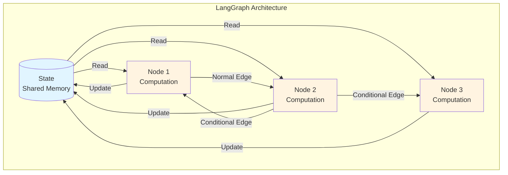
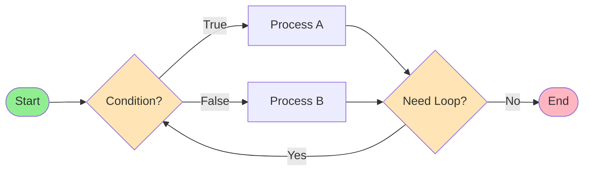
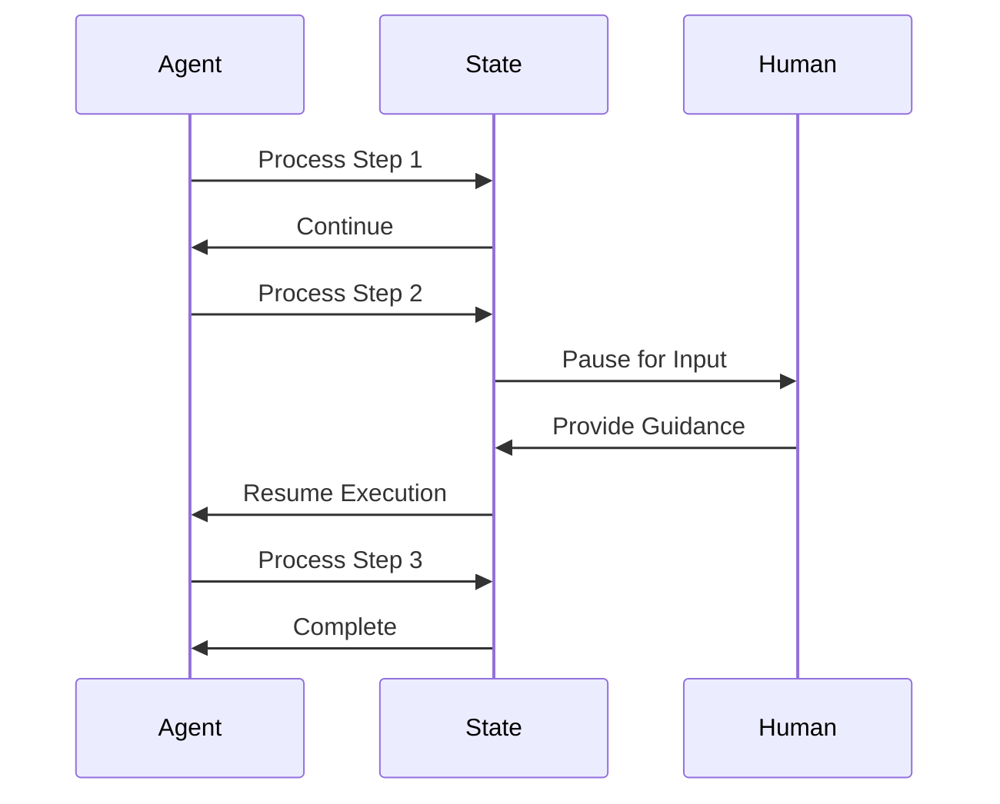
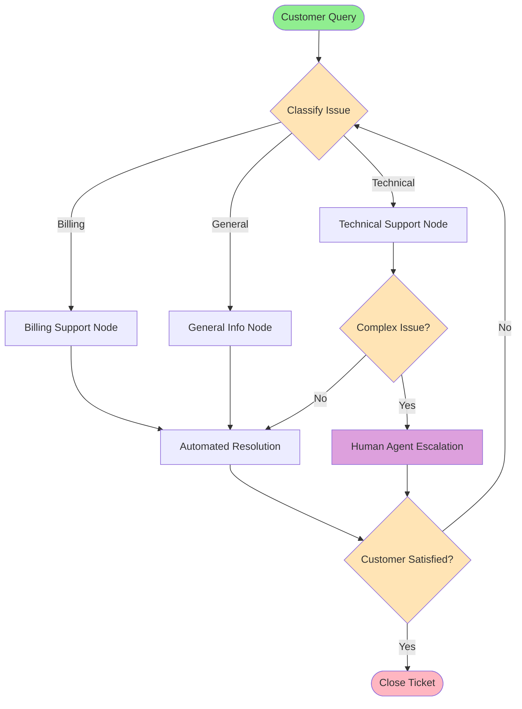
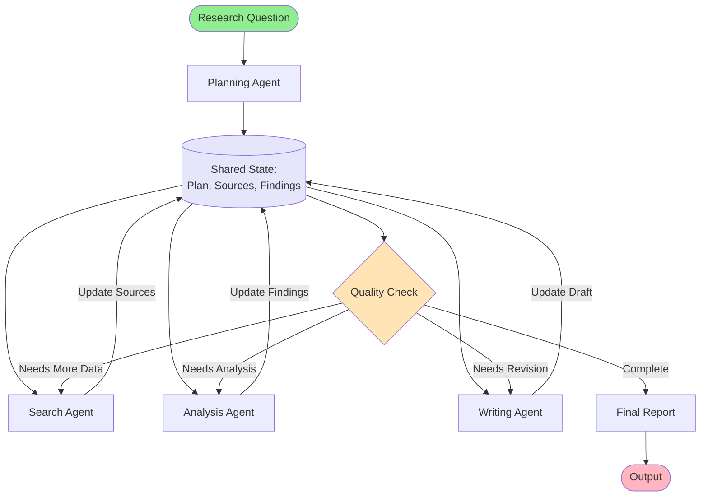

# LangGraph: Core Components and Guided Learning

**A comprehensive guide to understanding LangGraph's architecture and capabilities for building stateful AI agent workflows**

---

## Table of Contents
1. Introduction
2. What is LangGraph?
3. Core Components
4. Key Capabilities
5. LangGraph vs Traditional Programming
6. Use Cases
7. Visualization
8. Summary

---

## Introduction

LangGraph is an advanced framework within the LangChain ecosystem designed for building **stateful, multi-agent applications**. It provides a low-level, flexible approach that gives you complete control over your AI workflows without restrictive abstractions.

---

## What is LangGraph?

LangGraph models agent workflows as **graphs**, providing a structured yet flexible way to design complex AI applications. Unlike traditional linear programming approaches, LangGraph enables:

- Dynamic decision-making
- Context preservation across interactions
- Complex branching and looping logic
- Human oversight and intervention

---

## Core Components



### 1. **Nodes**
- Individual steps or functions that perform actual computation
- Each node processes information and can modify the state
- Can represent different agents, tools, or processing functions
- Developed and tested independently for modularity

### 2. **Edges**
- Define the execution flow between nodes
- Show the path from one step to the next
- **Types of Edges:**
  - **Normal Edges**: Direct, unconditional connections
  - **Conditional Edges**: Dynamic routing based on runtime decisions
  
### 3. **State**
- A shared data structure or memory across all nodes
- Remembers everything throughout the workflow
- Keeps your workflow's context alive
- Can be updated and modified as execution progresses
- Typically defined as TypedDict or Pydantic models

### 4. **StateGraph**
- The main graph structure defining your application's workflow
- Manages state transitions between nodes
- Supports cyclic graphs for iterative processes

### 5. **Channels**
- Communication mechanism for state updates
- Support different reducers (append, overwrite, etc.)

### 6. **Compilation**
- `.compile()` method creates executable graph
- Applies optimizations and validation
- Required before running the graph

---

## Key Capabilities

### **Looping and Branching**
- Agents can make dynamic decisions during execution
- Non-linear workflows that adapt based on conditions
- Cyclic graphs for iterative problem-solving



### **State Persistence**
- Maintain context over long interactions
- Full conversational memory across multiple turns
- Checkpoint system for saving/loading state

### **Human-in-the-Loop Functionality**
- Pause execution for human intervention
- Manual oversight when needed
- Resume execution seamlessly after input



### **Time Travel**
- Rewind to previous states for debugging
- Replay execution from any checkpoint
- Enhanced observability for monitoring workflows

### **Enhanced Observability**
- Clear insights into execution paths
- Invaluable for debugging and monitoring
- Track state changes across nodes

### **Modularity**
- Each node can be developed independently
- Promotes reusable components
- Easier testing and maintenance

---

## LangGraph vs Traditional Programming

### **Traditional Loops and Conditionals**

**Limitations:**
- **Linear execution**: For/while loops and if statements are sequential
- **No context memory**: Don't maintain state across iterations
- **Limited flexibility**: Not suitable for complex stateful workflows
- **Repetitive**: Only repeat code blocks until conditions are met

**Example:**
```python
# Traditional approach - limited context
while not valid_input:
    user_input = get_input()
    if is_valid(user_input):
        process(user_input)
        valid_input = True
```

### **LangGraph Advantages**

**Explicit State Management**
- Workflows maintain and modify context across nodes
- Full memory of past interactions

**Conditional Transitions**
- Runtime decision-making
- Dynamic branching based on current state

**Modularity**
- Independent node development
- Reusable components

**Enhanced Observability**
- Clear execution path visibility
- Better debugging capabilities

**Example:**
```python
# LangGraph approach - rich context and flexibility
from langgraph.graph import StateGraph
from typing import TypedDict

class AgentState(TypedDict):
    messages: list
    context: dict
    next_action: str

def node_process(state: AgentState) -> AgentState:
    # Can branch, loop, pause for human input, and resume
    # All while retaining full conversational memory
    return state

graph = StateGraph(AgentState)
graph.add_node("process", node_process)
```

---

## Use Cases

### **Customer Support Agent Example**



**Traditional While Loop:**
- Keeps asking until valid input
- No memory of past topics
- Linear, inflexible flow

**LangGraph Workflow:**
- Branches based on customer needs
- Loops for clarification
- Pauses for human agent escalation
- Resumes execution seamlessly
- Retains full conversational memory
- Maintains context across entire interaction

### **Best Suited For:**
- Sophisticated AI agents requiring dynamic decision-making
- Multi-step workflows with complex logic
- Applications needing context preservation
- Systems requiring human oversight
- Long-running conversations or processes

---

## Visualization

LangGraph graphs can be **visualized using Mermaid diagrams**, making it easier to:
- Understand graph structure intuitively
- Debug complex workflows
- Document agent behavior
- Share designs with team members

**Core Primitives in Diagrams:**
- Nodes (computation units) clearly represented
- Edges (flow paths) explicitly shown
- State transitions visible
- Decision points highlighted

This visualization capability allows for constructing intricate workflows with **clear and maintainable structures**.

### **Example: Multi-Agent Research Workflow**



---

## Summary

### **Key Takeaways:**

1. **LangGraph** is an advanced framework for building stateful, multi-agent applications

2. **Core Components:**
   - **Nodes**: Functions performing computation
   - **Edges**: Define execution flow
   - **State**: Shared memory across nodes

3. **Unique Capabilities:**
   - Looping and branching for dynamic decisions
   - State persistence for long interactions
   - Human-in-the-loop for interventions
   - Time travel for debugging

4. **Advantages over Traditional Programming:**
   - Explicit state management
   - Conditional transitions at runtime
   - Modular, reusable components
   - Enhanced observability

5. **Workflow Power:**
   - Branch, loop, and pause execution
   - Resume seamlessly
   - Preserve full conversational memory

6. **Visualization:**
   - Mermaid diagrams for clear representation
   - Core primitives (nodes/edges) explicitly shown

---

## Next Steps

To start building with LangGraph:
1. Set up your development environment
2. Define your state schema
3. Create nodes for each computation step
4. Connect nodes with edges
5. Compile and test your graph
6. Add checkpointing for persistence
7. Visualize your workflow

**LangGraph empowers you to build sophisticated AI agents with complete control, flexibility, and observability.**
