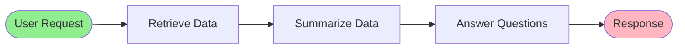
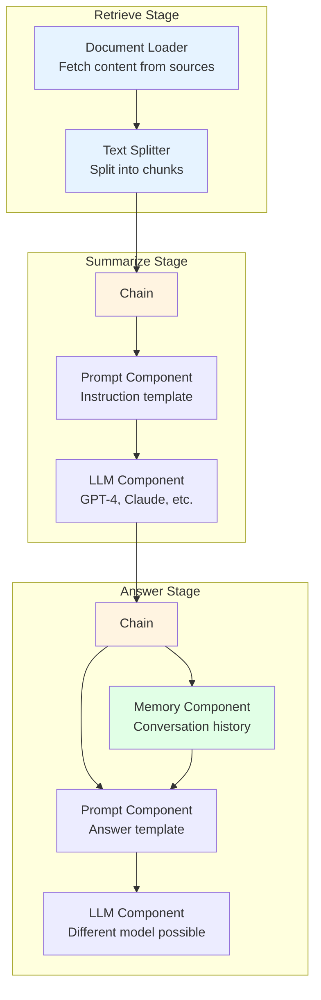
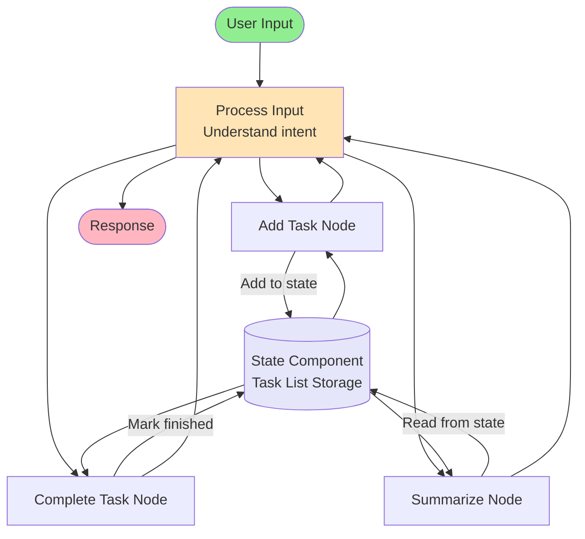
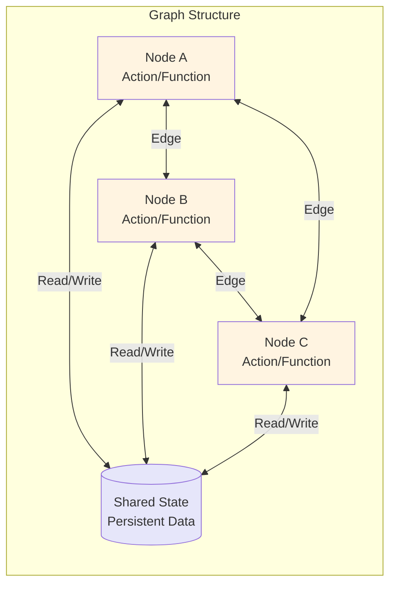
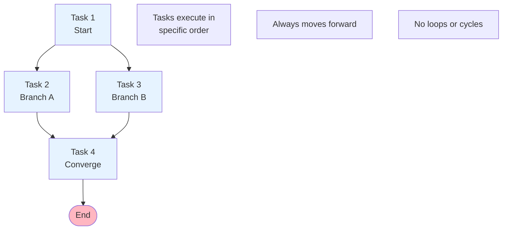
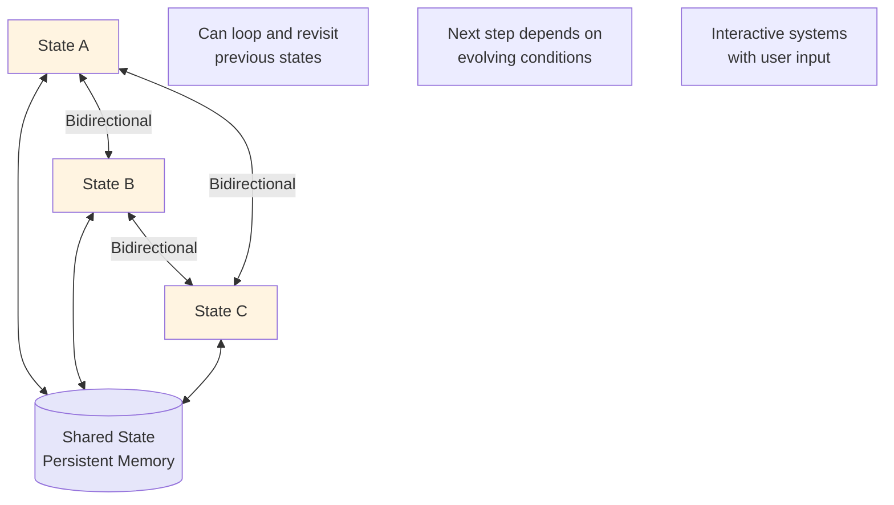
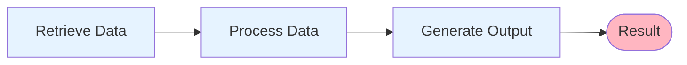
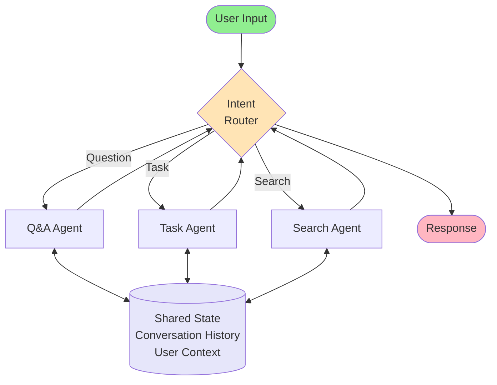
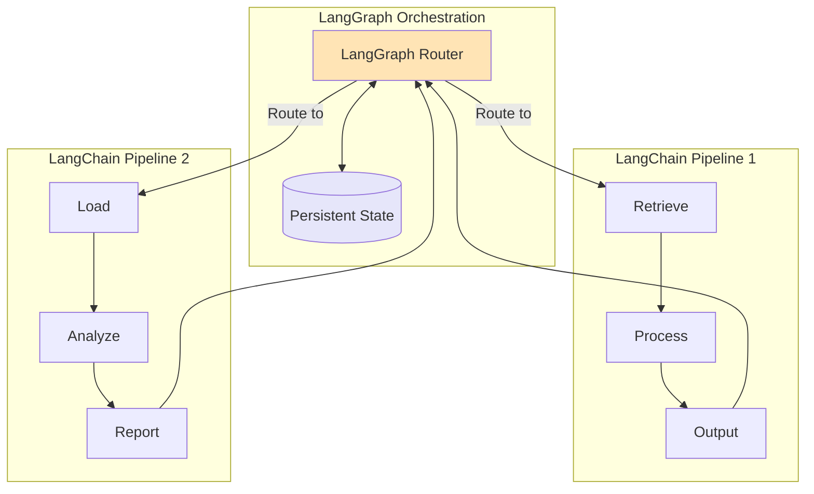
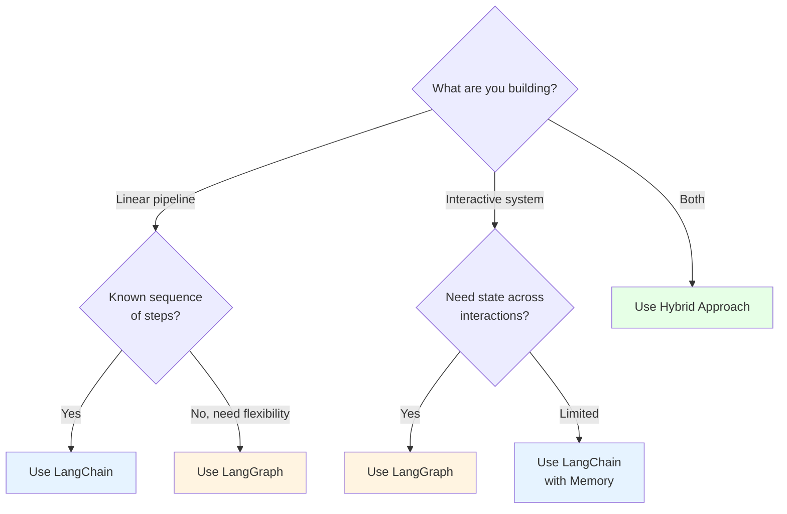

# LangGraph vs LangChain: When to Use What

**A comprehensive comparison guide to help you choose the right framework for your LLM-powered applications**

---

## Table of Contents
1. Overview
2. What is LangChain?
3. What is LangGraph?
4. Direct Comparison
5. Architecture Differences
6. When to Use What
7. Summary

---

## Overview

LangChain and LangGraph are both open-source frameworks designed to help developers build applications with large language models. While they share the same ecosystem, they serve different purposes and excel in different scenarios.

---

## What is LangChain?

At its core, **LangChain is a framework for building LLM-powered applications by executing a sequence of functions in a chain**. It provides an abstraction layer for chaining LLM operations into cohesive applications.

### Example Workflow: Retrieve → Summarize → Answer

### LangChain Components Architecture

### Key Features of LangChain

**Modular Architecture**
- Combine high-level components to build complex workflows
- Mix and match different LLMs for different stages
- Reusable components across applications

**Core Components:**
- **Document Loaders**: Fetch and load content from various data sources
- **Text Splitters**: Split text into smaller, semantically meaningful chunks
- **Chains**: Orchestrate sequences of operations
- **Prompts**: Templates for instructing LLMs
- **LLM Components**: Interface with different large language models
- **Memory**: Store conversation history and context
- **Agents**: Coordinate between components

---

## What is LangGraph?

**LangGraph is a specialized library within the LangChain ecosystem, specifically designed for building stateful, multi-agent systems**. It can handle complex, non-linear workflows with loops, cycles, and dynamic decision-making.

### Example Workflow: Task Management Assistant

### LangGraph Components Architecture

### Key Features of LangGraph

**Graph-Based Architecture**
- Non-linear workflows with loops and cycles
- Dynamic routing based on runtime conditions
- Revisit previous states as needed

**Core Components:**
- **Nodes**: Individual processing units or agents
- **Edges**: Transitions between nodes (normal and conditional)
- **State**: Central component accessible and modifiable by all nodes
- **Graph**: Overall structure managing the workflow

**Stateful Interactions**
- All nodes can access and modify shared state
- Maintain context over extended interactions
- Handle various requests in any order

---

## Direct Comparison

### Comparison Table

| Dimension | LangChain | LangGraph |
|-----------|-----------|-----------|
| **Primary Focus** | Abstraction layer for chaining LLM operations into applications | Create and manage multi-agent systems and workflows |
| **Structure** | Chain structure (DAG - Directed Acyclic Graph) | Graph structure (allows loops and cycles) |
| **Execution Flow** | Sequential, always moving forward | Can loop back and revisit previous states |
| **State Management** | Limited; passes information forward, some memory components available | Robust; state is a core component accessible by all nodes |
| **Complexity** | Suited for linear, sequential tasks | Handles complex, interactive, non-linear scenarios |
| **Use Cases** | Data retrieval → processing → output pipelines | Virtual assistants, multi-agent systems, adaptive workflows |
| **Components** | Chains, Prompts, LLMs, Memory, Agents, Document Loaders | Nodes, Edges, State, Graph |
| **Flexibility** | Predefined sequence with some branching capability | Highly flexible with dynamic routing and loops |
| **Context Persistence** | Conversation memory within chains | Persistent state across all interactions |

---

## Architecture Differences

### LangChain: DAG Structure (Directed Acyclic Graph)

**Characteristics:**
- Tasks executed in specific order
- Always moving forward
- Great when you know the exact sequence of steps needed
- Can branch but cannot loop back

### LangGraph: Cyclic Graph Structure

**Characteristics:**
- Allows loops and revisiting previous states
- Beneficial for interactive systems
- Next step depends on evolving conditions or user input
- Maintains persistent state across all nodes

---

## When to Use What

### Use LangChain When:

**Sequential Task Pipelines**

**Ideal Scenarios:**
- You have a clear, linear sequence of operations
- Data flows in one direction (input → processing → output)
- Building RAG (Retrieval Augmented Generation) pipelines
- Document processing workflows
- Simple question-answering systems
- Content generation pipelines
- Data extraction and transformation tasks

**Example Use Cases:**
- Research assistant that retrieves papers, summarizes them, and answers questions
- Content generator that fetches data, processes it, and creates articles
- Document analyzer that loads files, extracts information, and formats results

**Limitations:**
- Not ideal for scenarios requiring complex decision trees
- Limited ability to maintain long-term conversational context
- Difficult to handle dynamic, user-driven workflows

---

### Use LangGraph When:

**Complex Multi-Agent Systems**

**Ideal Scenarios:**
- Complex systems requiring ongoing interaction and adaptation
- Workflows need to loop back based on conditions
- Multiple agents need to collaborate
- Maintaining context over long conversations
- Handling varying types of requests dynamically
- Systems requiring human-in-the-loop interventions

**Example Use Cases:**
- Virtual assistant maintaining context over long conversations
- Customer support agent handling various request types
- Interactive tutoring system adapting to student responses
- Multi-agent research system with planning, searching, and writing agents
- Game AI with complex decision-making and state management

**Advantages:**
- Robust state management across all interactions
- Flexible routing and decision-making
- Can handle unpredictable user flows
- Better for conversational AI applications

---

### Hybrid Approach

You can use **both frameworks together**:

**When to Use Hybrid:**
- Use LangGraph for high-level orchestration and state management
- Use LangChain for specific sequential pipelines within nodes
- Best of both worlds: stateful routing + efficient chains

---

## Summary

### Key Takeaways

**LangChain:**
- Framework for chaining LLM operations
- DAG structure (directed, acyclic)
- Sequential task execution
- Limited state management
- Best for: Data pipelines, RAG systems, linear workflows

**LangGraph:**
- Framework for multi-agent systems
- Graph structure (allows loops and cycles)
- Non-linear, interactive execution
- Robust state management
- Best for: Virtual assistants, complex agents, adaptive systems

**Decision Framework:**

**Remember:**
- LangChain excels at **sequential, predictable workflows**
- LangGraph excels at **complex, stateful, interactive systems**
- Both are powerful tools in the LLM application development ecosystem
- They can be used together for sophisticated applications

Choose based on your specific use case requirements, complexity, and the level of state management and flexibility you need.
