# Overview: Types of AI Agents

**A comprehensive guide to understanding the five main types of AI agents, their capabilities, and limitations**

---

## Table of Contents
1. Introduction
2. Classification Framework
3. Type 1: Simple Reflex Agent
4. Type 2: Model-Based Reflex Agent
5. Type 3: Goal-Based Agent
6. Type 4: Utility-Based Agent
7. Type 5: Learning Agent
8. Comparison Summary
9. Multi-Agent Systems
10. Practical Applications

---

## Introduction

AI agents are classified based on:
- **Level of intelligence**
- **Decision-making processes**
- **How they interact with their surroundings**
- **Ability to reach desired outcomes**

New agentic workflows and models are released frequently, often automating tasks that previously required human expertise. Understanding the differences between agent types helps distinguish a simple reflex agent from an advanced learning agent.

---

## Classification Framework

### Agent Complexity Spectrum

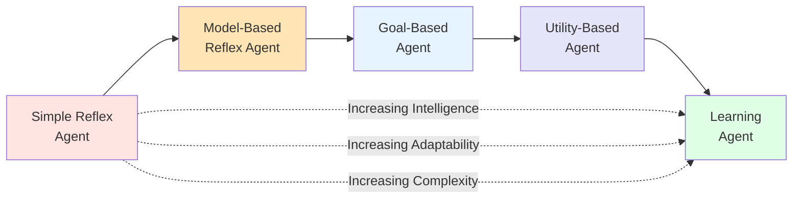

---

## Type 1: Simple Reflex Agent

### Definition

The **most basic type of AI agent** that follows predefined rules to make decisions based on current percepts only.

### Architecture

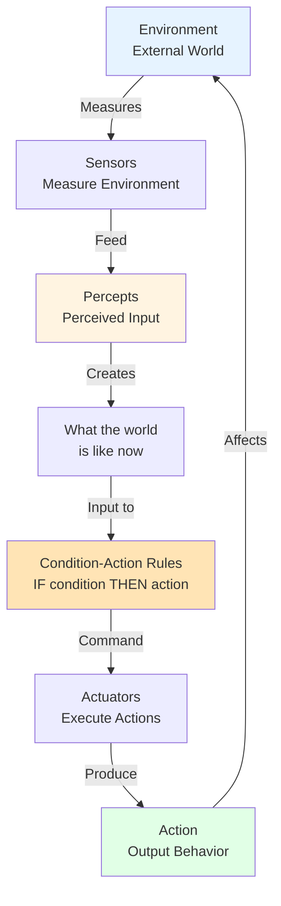

### Core Logic: Condition-Action Rules

**Structure:** IF condition THEN action

**Example: Thermostat**
```
IF temperature < 18°C THEN turn_on_heat()
IF temperature >= 22°C THEN turn_off_heat()
```

### Characteristics

| Aspect | Description |
|--------|-------------|
| **Memory** | None - no past information stored |
| **Decision Basis** | Current percepts only |
| **Logic** | Predefined condition-action rules |
| **Speed** | Fast execution |
| **Adaptability** | None - cannot learn or adapt |

### Strengths

- Fast and efficient
- Simple to implement
- Effective in structured, predictable environments
- Well-defined rules work well in stable conditions

### Weaknesses

- Cannot handle dynamic scenarios
- No memory of past states
- Repeatedly makes same mistakes
- Insufficient for handling new situations
- No learning capability

### Example Use Cases

- Thermostats
- Basic light sensors
- Simple automated doors
- Basic alarm systems

---

## Type 2: Model-Based Reflex Agent

### Definition

A more advanced version of the simple reflex agent that uses condition-action rules **plus an internal model of the world**.

### Architecture

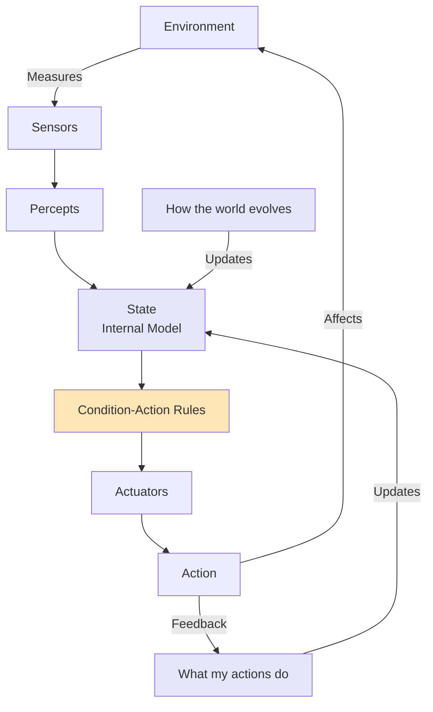

### Key Components

**State Component:**
- Stores internal model of the world
- Updated by observing environment changes
- Tracks effects of agent's own actions

**Two Knowledge Models:**
1. **How the world evolves**: Understanding state transitions
2. **What my actions do**: Understanding action consequences

### Decision-Making Process

Instead of using raw percepts, the agent uses:
- Current state (memory)
- How the world changes
- Effects of actions
- Condition-action rules

### Example: Robotic Vacuum Cleaner

**Internal State Stores:**
- Areas already cleaned
- Current location
- Obstacle positions
- Battery level

**Decision Logic:**
```
IF (current_area == dirty) AND (not_cleaned_yet) THEN vacuum()
IF (battery < 20%) AND (near_charging_station) THEN return_to_charge()
```

**Model-Based Reasoning:**
- Infers parts of environment it can't currently observe
- Remembers where it has been
- Knows that moving forward changes its location
- Understands consequences of actions

### Characteristics

| Aspect | Description |
|--------|-------------|
| **Memory** | Yes - internal state model |
| **Decision Basis** | Current state + past observations |
| **Logic** | Condition-action rules + world model |
| **Adaptability** | Limited - still reactive |
| **Planning** | No - does not plan ahead |

### Strengths

- Maintains memory of past states
- Can handle partially observable environments
- Infers hidden information
- Better than simple reflex in dynamic environments

### Weaknesses

- Still reactive (not proactive)
- No planning capability
- Limited to predefined rules
- Cannot optimize for future goals

---

## Type 3: Goal-Based Agent

### Definition

Builds on the model-based agent by adding **goal-directed decision-making**. The agent doesn't just react; it plans actions to achieve specific goals.

### Architecture

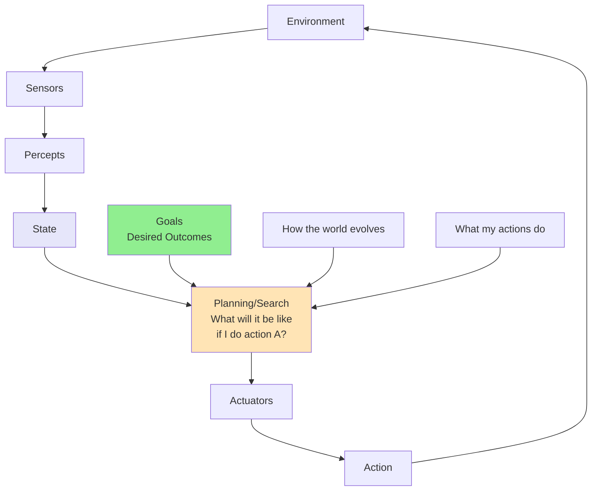

### Key Shift in Decision-Making

**Simple/Model-Based Reflex Agent asks:**
"What action matches this condition?"

**Goal-Based Agent asks:**
"What action will help me achieve my goal based on current state and predicted future?"

### Decision Process

1. **Current State**: Where am I now?
2. **Goal**: Where do I want to be?
3. **Prediction**: If I do action A, what will happen?
4. **Evaluation**: Will that help me reach my goal?
5. **Action**: Execute the action that leads to goal

### Example: Self-Driving Car

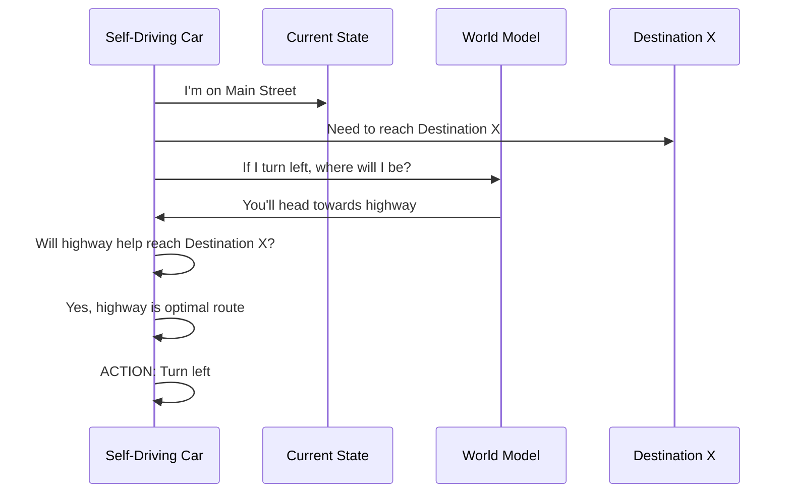

**Thought Process:**
```
Current State: "I'm on Main Street"
Goal: "Get to destination X"
Prediction: "If I turn left → I'll head towards highway"
Evaluation: "Will that help reach destination X?" → Yes
Action: Turn left
```

### Characteristics

| Aspect | Description |
|--------|-------------|
| **Memory** | Yes - state model |
| **Decision Basis** | Goals + predicted outcomes |
| **Logic** | Future simulation and planning |
| **Planning** | Yes - considers future states |
| **Optimization** | No - any path to goal works |

### Strengths

- Goal-directed behavior
- Plans actions toward objectives
- Simulates future outcomes
- Adapts to environment changes
- Better decision-making than reflex agents

### Weaknesses

- Doesn't optimize between multiple valid paths
- All goal-achieving actions are equally good
- No preference ranking
- Can be computationally expensive

### Use Cases

- Robotics
- Navigation systems
- Game AI
- Autonomous vehicles
- Simulations with clear objectives

---

## Type 4: Utility-Based Agent

### Definition

Considers not just **if a goal is met**, but **how desirable different outcomes are**. It ranks options and chooses the best one.

### Architecture

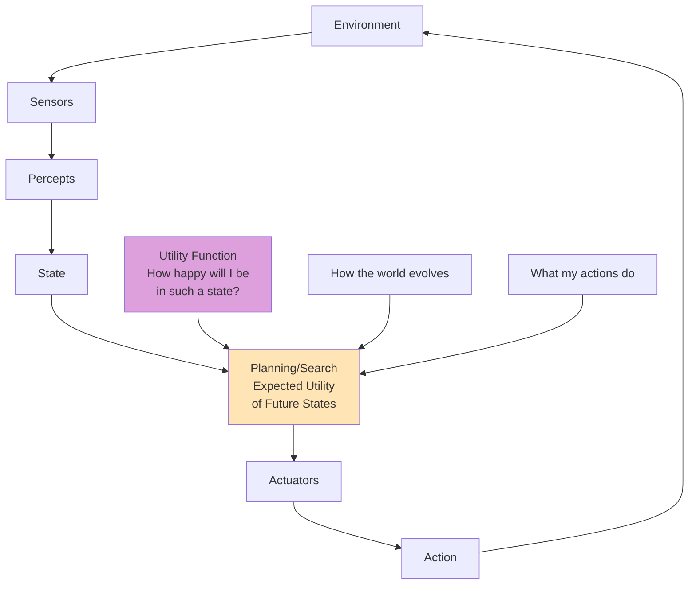

### Utility Function

**Utility** = Happiness score or preference value for an outcome

For each possible future state, the agent asks:
- "How happy will I be in such a state?"
- "What is the expected utility of this future state?"

This allows the agent to **rank options**, not just pick anything that meets the goal.

### Example: Autonomous Drone Delivery

#### Goal-Based Approach
```
Goal: Deliver package to address X
Action: Any route that completes delivery
Result: Mission accomplished (but may be inefficient)
```

#### Utility-Based Approach
```
Objective: Deliver package quickly + safely + minimum energy

Utility Function:
U(route) = w1 * speed + w2 * safety + w3 * energy_efficiency

Process:
1. Simulate multiple paths
2. For each path, estimate:
   - Duration
   - Battery level
   - Weather conditions
   - Safety risk
3. Calculate utility score for each
4. Pick route that maximizes utility
```

### Comparison Example

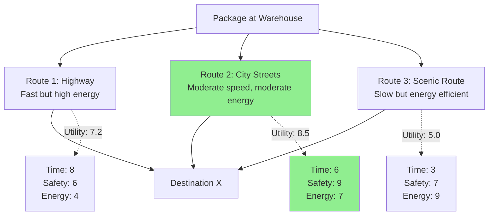

**Goal-Based:** Any route works
**Utility-Based:** Route 2 chosen (highest utility score of 8.5)

### Characteristics

| Aspect | Description |
|--------|-------------|
| **Memory** | Yes - state model |
| **Decision Basis** | Utility maximization |
| **Logic** | Preference ranking |
| **Planning** | Yes - with optimization |
| **Optimization** | Yes - chooses best outcome |

### Strengths

- Optimizes for best outcome, not just any outcome
- Handles conflicting objectives
- Balances multiple factors
- More sophisticated decision-making
- Better real-world performance

### Weaknesses

- Requires accurate utility function
- Computationally intensive
- Difficult to design good utility functions
- May be overkill for simple tasks

### Use Cases

- Autonomous vehicles (route optimization)
- Resource allocation
- Financial trading systems
- Drone delivery
- Smart home systems

---

## Type 5: Learning Agent

### Definition

The **most adaptable and powerful** agent type. Rather than being hard-coded or goal-driven, it **learns from experience** and improves performance over time.

### Architecture

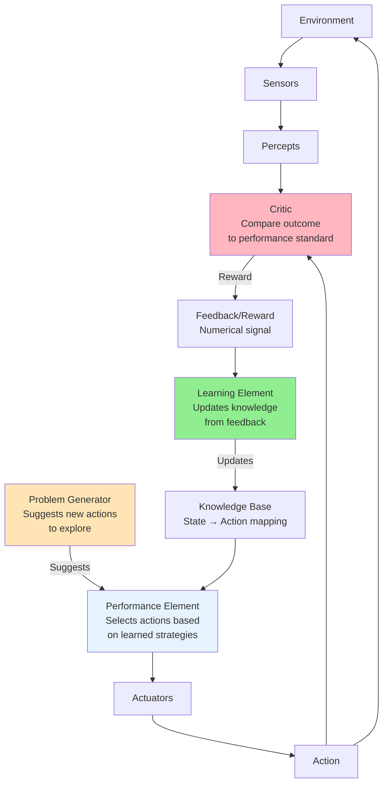

### Key Components

| Component | Role | Function |
|-----------|------|----------|
| **Critic** | Observer | Observes action outcomes, compares to performance standard |
| **Feedback/Reward** | Signal | Numerical feedback (often called reward in RL) |
| **Learning Element** | Updater | Updates agent's knowledge using feedback |
| **Performance Element** | Executor | Selects actions based on learned optimal strategies |
| **Problem Generator** | Explorer | Suggests new actions the agent hasn't tried yet |

### Learning Process

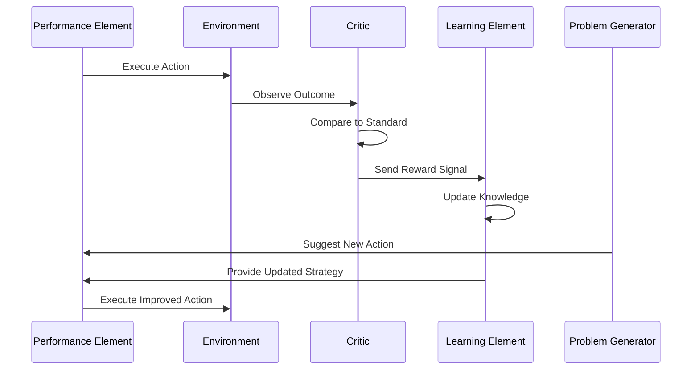

### Example: AI Chess Bot

**Performance Element:**
- Plays the game using current learned strategies
- Executes moves based on learned knowledge

**Critic:**
- Observes: "Lost the match"
- Compares outcome to goal (winning)
- Generates negative reward

**Learning Element:**
- Adjusts strategy based on outcomes of thousands of games
- Updates state-to-action mappings
- Improves move selection over time

**Problem Generator:**
- Suggests new moves not yet explored
- "Try this opening strategy"
- "Experiment with this endgame position"

### Learning Cycle

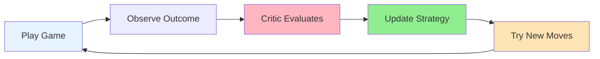

### Characteristics

| Aspect | Description |
|--------|-------------|
| **Memory** | Yes - learned knowledge |
| **Decision Basis** | Learned from experience |
| **Logic** | Adaptive, improves over time |
| **Planning** | Can develop planning strategies |
| **Optimization** | Yes - learns optimal behavior |
| **Adaptability** | Highest - continuous improvement |

### Strengths

- Learns from experience
- Improves performance over time
- Adapts to changing environments
- Handles unknown situations
- Most flexible and powerful
- Can discover novel strategies

### Weaknesses

- Slowest to develop initially
- Most data-intensive
- Requires extensive training
- May need large amounts of feedback
- Can learn incorrect behaviors
- Computationally expensive

### Use Cases

- Game AI (chess, Go, video games)
- Recommendation systems
- Autonomous vehicles (improving from experience)
- Robotic control
- Natural language processing
- Personalization systems

---

## Comparison Summary

### Quick Reference Table

| Agent Type | Reacts | Remembers | Plans | Aims | Evaluates | Improves |
|------------|--------|-----------|-------|------|-----------|----------|
| **Simple Reflex** | ✓ | ✗ | ✗ | ✗ | ✗ | ✗ |
| **Model-Based Reflex** | ✓ | ✓ | ✗ | ✗ | ✗ | ✗ |
| **Goal-Based** | ✓ | ✓ | ✓ | ✓ | ✗ | ✗ |
| **Utility-Based** | ✓ | ✓ | ✓ | ✓ | ✓ | ✗ |
| **Learning** | ✓ | ✓ | ✓ | ✓ | ✓ | ✓ |

### Detailed Comparison

| Aspect | Simple Reflex | Model-Based | Goal-Based | Utility-Based | Learning |
|--------|---------------|-------------|------------|---------------|----------|
| **Core Capability** | Reacts | Remembers | Aims | Evaluates | Improves |
| **Decision Logic** | Fast execution | Tracking state | Goal-directed | Best outcome | Learn from experience |
| **Memory** | No memory | State tracking | State + goals | State + utility | Learned knowledge |
| **Past Understanding** | No history | Tracks over time | Considers future | Ranks options | Updates from feedback |
| **Planning** | None | Still reactive | Plans to goal | Optimizes plan | Develops strategies |
| **Flexibility** | Any way works | Condition-based | Any goal path | Best path | Adapts continuously |
| **Requirements** | Predefined rules | World model | Goals defined | Utility function | Training data |
| **Speed** | Fastest | Fast | Moderate | Slower | Slowest initially |
| **Data Intensity** | Minimal | Low | Moderate | Moderate | Highest |
| **Use Case** | Simple tasks | Partial observability | Clear objectives | Multiple criteria | Complex, evolving |

### Decision-Making Comparison

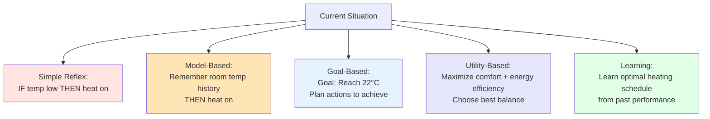

---

## Multi-Agent Systems

### Definition

**Multi-agent system** = Multiple agents operating in a shared environment, working cooperatively towards a common goal.

### Architecture

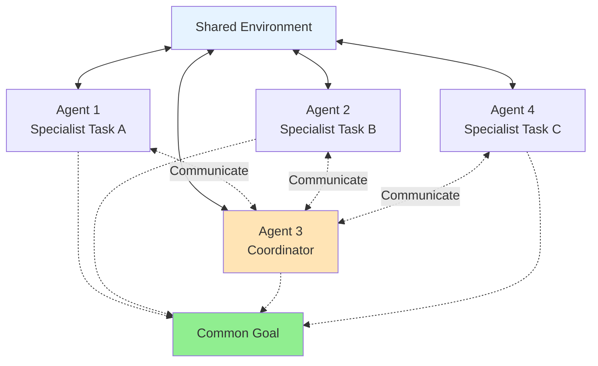

### Characteristics

- **Shared Environment**: All agents operate in the same world
- **Cooperative Behavior**: Working together, not competing
- **Common Goal**: Unified objective
- **Distributed Intelligence**: Each agent may specialize
- **Communication**: Agents share information
- **Coordination**: Synchronized actions

### Benefits

- Divide complex tasks among specialists
- Parallel processing
- Redundancy and robustness
- Scalability
- Emergent intelligence

### Example: Warehouse Automation

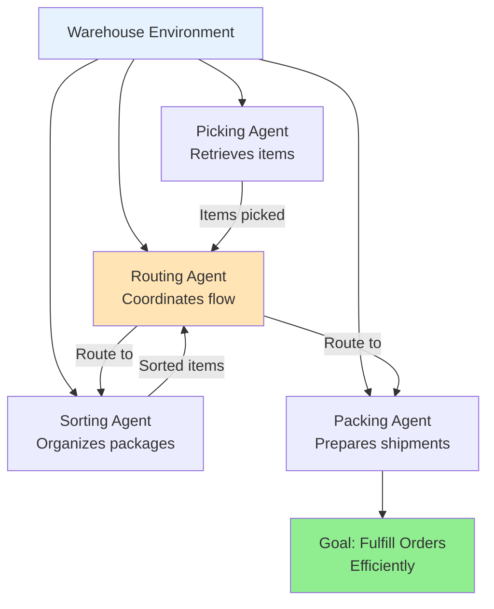

---

## Practical Applications

### Application by Agent Type

| Domain | Agent Type | Justification |
|--------|------------|---------------|
| **Thermostat** | Simple Reflex | Predictable rules, fast response needed |
| **Robotic Vacuum** | Model-Based | Needs to remember cleaned areas, obstacle locations |
| **GPS Navigation** | Goal-Based | Clear destination goal, plan route to reach it |
| **Ride-Share Pricing** | Utility-Based | Balance multiple factors: demand, distance, time |
| **Game AI** | Learning | Improves strategy through experience |
| **Spam Filter** | Learning | Adapts to new spam patterns |
| **Smart Home** | Utility-Based | Optimize comfort, energy, security |
| **Warehouse Robots** | Multi-Agent | Coordinate multiple specialized tasks |

### The Human-in-the-Loop Factor

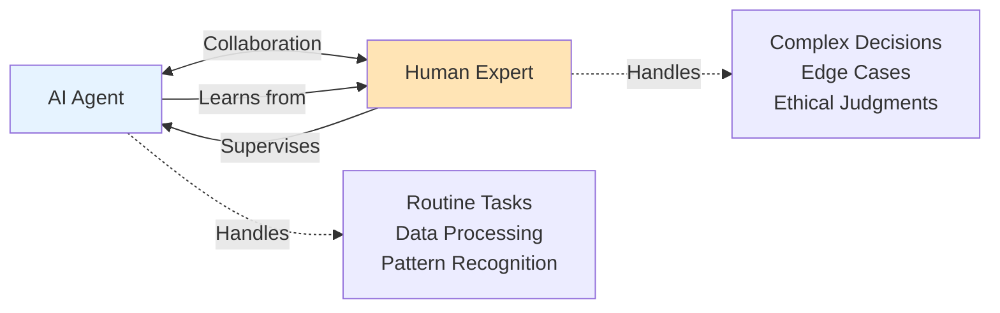

**Key Points:**
- AI agents work best with human oversight (at least for now)
- Humans handle edge cases and complex decisions
- Agents handle routine, repetitive tasks
- Collaboration enhances both capabilities
- Learning agents improve from human feedback

---

## Summary

### Evolution of Intelligence

As agentic AI continues to evolve, particularly with learning agents making use of advances in generative AI, AI agents are becoming increasingly adept at handling complex use cases.

### Key Takeaways

1. **Simple Reflex Agent**: Fast but reactive, no memory
2. **Model-Based Reflex Agent**: Remembers state, still reactive
3. **Goal-Based Agent**: Plans toward objectives
4. **Utility-Based Agent**: Chooses optimal outcomes
5. **Learning Agent**: Adapts and improves from experience

### Choosing the Right Agent

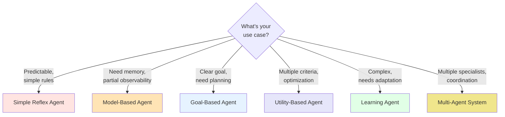

### The Future

- Learning agents are becoming more powerful
- Integration with generative AI expanding capabilities
- Multi-agent systems enabling complex coordination
- Human-in-the-loop remains important
- Agentic AI continues to automate increasingly complex tasks

AI agents are not one-size-fits-all. Understanding the types and their capabilities helps you choose the right tool for your specific use case.
