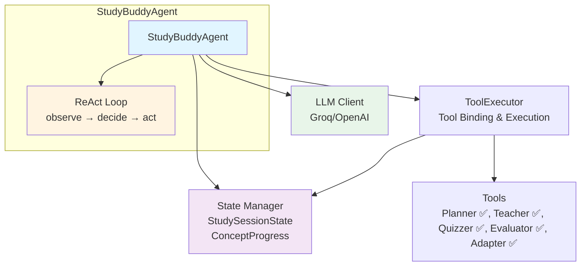
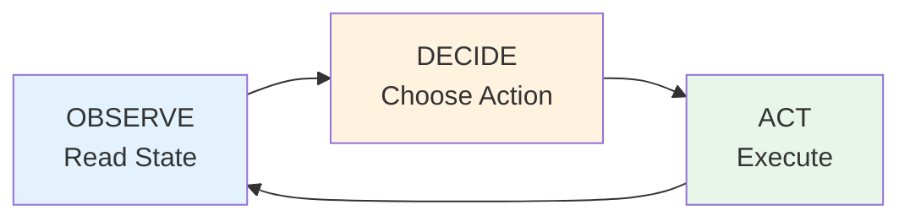

# EZ Agentic Study Buddy

A single-agent AI tutor that autonomously guides learners through topics using the ReAct (Reasoning + Acting) pattern.

**Started:** January 2026

## Overview

An AI agent that makes autonomous decisions about learning flow:
- Plans learning paths from topics
- Teaches concepts step-by-step
- Tests understanding with quizzes
- Evaluates responses and adapts difficulty
- Tracks progress throughout the session

## Core Architecture



### ReAct Pattern

The agent continuously loops through three phases:



1. **OBSERVE**: Reads current state (progress, scores, concepts taught)
2. **DECIDE**: Uses LLM to analyze state and choose next action
3. **ACT**: Executes chosen action and updates state

### Components

- **StudyBuddyAgent**: Main orchestrator managing the ReAct loop with LCEL chains
- **LLM Client**: Interface to language models (Groq default, OpenAI optional)
- **State Manager**: Tracks session progress using Pydantic models
- **Decision Rules**: Rule-based decision making for autonomous actions
- **Retry Manager**: Handles retry logic and alternative teaching strategies
- **ToolExecutor**: Manages tool binding, execution, and automatic state updates
- **Tools**: 
  - Planner (creates learning paths)
  - Teacher (generates explanations with retry support)
  - Quizzer (creates quizzes)
  - Evaluator (evaluates responses with explicit scoring)
  - Adapter (adjusts difficulty based on performance)

For detailed architecture, see [ARCHITECTURE.md](./ARCHITECTURE.md).

## Quick Start

```python
from agent.core.agent import StudyBuddyAgent

agent = StudyBuddyAgent(topic="Python Basics", max_iterations=50)
result = agent.run()
```

See [USAGE.md](USAGE.md) for detailed usage guide and examples.

### Prerequisites

- Python 3.11+
- [uv](https://github.com/astral-sh/uv) package manager
- Groq API key ([console.groq.com](https://console.groq.com) - free)

### Setup

```bash
# Install dependencies
uv sync

# Configure environment
cp .env.example .env
# Edit .env and add your GROQ_API_KEY

# Test setup
uv run python scripts/test_llm.py
```

### Usage

```python
from agent.core.agent import StudyBuddyAgent

agent = StudyBuddyAgent(topic="Python Basics", max_iterations=50)
result = agent.run()
```

See [USAGE.md](USAGE.md) for detailed usage guide, examples, and best practices.

## Project Structure

```
agent/
├── chains/
│   └── decision_chain.py    # LCEL chains for ReAct loop
├── core/
│   ├── agent.py             # StudyBuddyAgent class
│   ├── state.py             # State models (StudySessionState, ConceptProgress)
│   ├── decision_rules.py    # Rule-based decision making
│   ├── retry_manager.py     # Retry logic and strategies
│   ├── quiz_workflow.py     # Quiz generation and evaluation workflow
│   └── tool_executor.py     # Tool execution and state updates
├── tools/
│   ├── planner_tool.py      # Learning path planning
│   ├── teacher_tool.py      # Concept teaching (with retry support)
│   ├── quizzer_tool.py      # Quiz generation
│   ├── evaluator_tool.py    # Response evaluation (explicit scoring)
│   └── adapter_tool.py      # Difficulty adaptation
└── utils/
    └── llm_client.py        # LLM initialization
```

## Documentation

- [Usage Guide](./USAGE.md) - Complete usage guide with examples and best practices
- [Architecture](./ARCHITECTURE.md) - System design and diagrams
- [Learning Notes](./LEARNINGS/) - Step-by-step implementation guide
- [Changelog](./CHANGELOG.md) - Version history

## License

MIT - See [LICENSE](./LICENSE) for details
