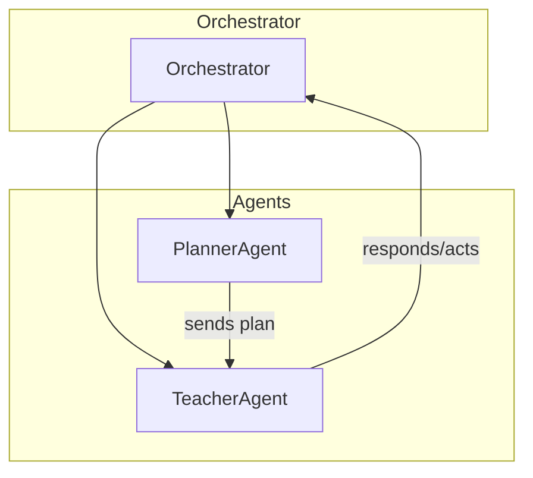
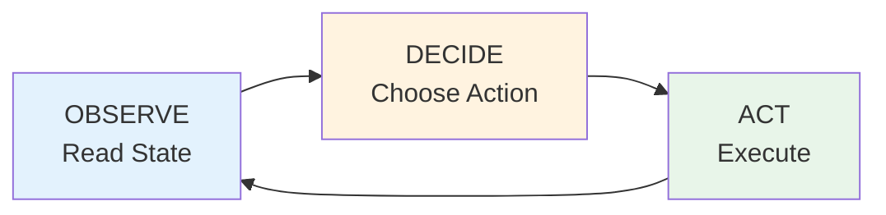

# EZ Agentic Study Buddy

**A Modular Multi-Agent Study Assistant Platform**

**Started:** January 2026


## Vision & MVP

## Features (Current Implementation)

- **Multi-Agent Collaboration:** Minimal multi-agent architecture implemented. Agents (Planner, Teacher) are independent classes with their own state and message handling. An orchestrator manages agent communication. More agents (Quizzer, Evaluator, Adapter) will be added as independent agents or modules.
- **Agentic Workflows:** Implements ReAct pattern and decision rules for autonomous learning flows.
- **Tool Integration:** Agents use modular tools for planning, teaching, quizzing, evaluating, and adapting.
- **State Management:** Tracks session progress and adapts difficulty using Pydantic models.
- **Retry & Error Handling:** Retry logic and alternative teaching strategies for robustness.
- **Content Loading:** Load and parse user materials (`.txt`, `.md`, `.json`, optional `.pdf`).
- **Minimal Web UI:** FastAPI upload endpoint + React UI for uploading and previewing parsed content.


## Tech Stack

- **Python 3.11+**
- **Pydantic** for state and data validation
- **LangGraph, CrewAI, BeeAI, AG2 (AutoGen)** concepts and patterns
- **Groq/OpenAI LLMs** (pluggable)
- **uv** package manager for fast dependency management


## Quick Start

```bash
# Install dependencies
uv sync

# Configure environment
cp .env.example .env
# Edit .env and add your GROQ_API_KEY

# Test setup
uv run python scripts/test_llm.py
```

See [USAGE.md](USAGE.md) for more details and examples.

## Minimal Web UI (Content Loader)

Backend (FastAPI):

```powershell
.venv\Scripts\python.exe -m pip install -e ".[web]"
.venv\Scripts\python.exe -m uvicorn webapi.main:app --reload --port 8000
```

Frontend (React):

```powershell
cd webui
npm install
npm run dev
```

EZ Agentic Study Buddy is an open-source, modular platform for building and running multi-agent AI study assistants. The MVP enables any user to:
- Install the repo and run it locally with minimal setup
- Add their own course materials or documentation (PDF, markdown, text) to the `materials/` folder
- Interact with agentic workflows (quiz generation, summarization, adaptive learning, etc.) via a simple UI (CLI or web)
- Receive quizzes, explanations, and feedback based only on their own uploaded content

**Why?**
- Empower anyone to turn their own materials into interactive learning experiences
- Showcase practical multi-agent AI, tool integration, and adaptive workflows
- Serve as a living lab for agentic AI experimentation and learning


## How to Use

1. **Clone the repo and install dependencies** (see Setup below)
2. **Add your course materials** (PDF, markdown, or text) to the `materials/` folder
3. **Run the UI** (CLI or web) to select documents and start agentic workflows (quiz, summarize, teach, etc.)
4. **Get interactive quizzes, explanations, and feedback based on your own content**

See [USAGE.md](USAGE.md) for detailed instructions and examples.

## Core Architecture


### Minimal Multi-Agent Architecture


```mermaid
flowchart TD
    subgraph Orchestrator
        O[Orchestrator]
    end
    subgraph Agents
        P[PlannerAgent]
        T[TeacherAgent]
    end
    O --> P
    O --> T
    P -- sends plan --> T
    T -- responds/acts --> O
```

**How it works:**
- Each agent is a class with its own state and message handler.
- The orchestrator instantiates agents and manages message passing.
- Agents communicate by sending and receiving messages (see `agent/core/agent_base.py`, `agent/agents/planner_agent.py`, `agent/agents/teacher_agent.py`, `agent/core/orchestrator.py`).

This foundation will be extended with more agents and richer workflows in future phases.

### ReAct Pattern

The agent continuously loops through three phases:


```mermaid
flowchart LR
    O[OBSERVE<br/>Read State] --> D[DECIDE<br/>Choose Action]
    D --> A[ACT<br/>Execute]
    A --> O
    
    style O fill:#e3f2fd
    style D fill:#fff3e0
    style A fill:#e8f5e9
```

1. **OBSERVE**: Reads current state (progress, scores, concepts taught)
2. **DECIDE**: Uses LLM to analyze state and choose next action
3. **ACT**: Executes chosen action and updates state

### Components

- **StudyBuddyAgent**: Main orchestrator managing the ReAct loop with LCEL chains
- **LLM Client**: Interface to language models (Groq default, OpenAI optional)
- **State Manager**: Tracks session progress using Pydantic models
- **Decision Rules**: Rule-based decision making for autonomous actions
- **Retry Manager**: Handles retry logic and alternative teaching strategies
- **ToolExecutor**: Manages tool binding, execution, and automatic state updates
- **Tools**: 
  - Planner (creates learning paths)
  - Teacher (generates explanations with retry support)
  - Quizzer (creates quizzes)
  - Evaluator (evaluates responses with explicit scoring)
  - Adapter (adjusts difficulty based on performance)

For detailed architecture, see [ARCHITECTURE.md](./ARCHITECTURE.md).

## Quick Start

```python
from agent.core.agent import StudyBuddyAgent

agent = StudyBuddyAgent(topic="Python Basics", max_iterations=50)
result = agent.run()
```

See [USAGE.md](USAGE.md) for detailed usage guide and examples.

### Prerequisites

- Python 3.11+
- [uv](https://github.com/astral-sh/uv) package manager
- Groq API key ([console.groq.com](https://console.groq.com) - free)

### Setup

```bash
# Install dependencies
uv sync

# Configure environment
cp .env.example .env
# Edit .env and add your GROQ_API_KEY

# Test setup
uv run python scripts/test_llm.py
```

### Usage

```python
from agent.core.agent import StudyBuddyAgent

agent = StudyBuddyAgent(topic="Python Basics", max_iterations=50)
result = agent.run()
```

See [USAGE.md](USAGE.md) for detailed usage guide, examples, and best practices.


## Project Structure

```
agent/           # Core logic, workflows, state, agent orchestration
tools/           # Modular tools (planner, teacher, quizzer, etc.)
utils/           # Utilities (LLM client, helpers)
materials/       # User-uploaded documents (PDF, markdown, text)
ui/              # CLI or web interface code
docs/            # User/developer documentation (optional)
LEARNINGS/       # Step-by-step notes, concepts, and learning journey
scripts/         # Test scripts
README.md, USAGE.md, ARCHITECTURE.md, etc.
```


## Documentation

- [Usage Guide](./USAGE.md) - Complete usage guide with examples and best practices
- [Architecture](./ARCHITECTURE.md) - System design and diagrams
- [Learning Notes](./LEARNINGS/) - Step-by-step implementation guide and agentic AI concepts
- [Changelog](./CHANGELOG.md) - Version history

## License

MIT - See [LICENSE](./LICENSE) for details
