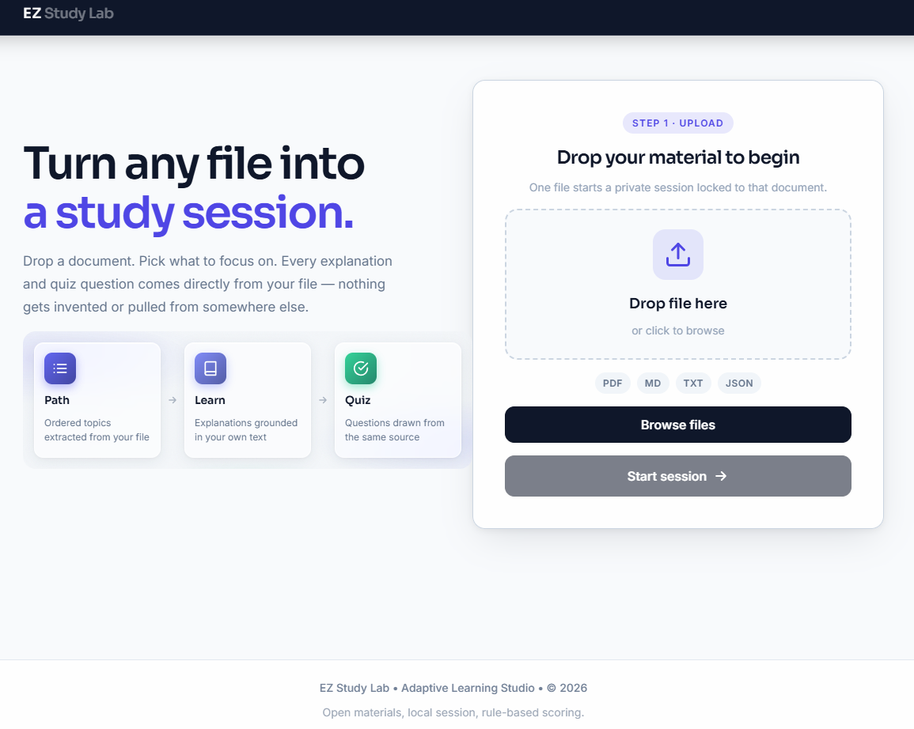
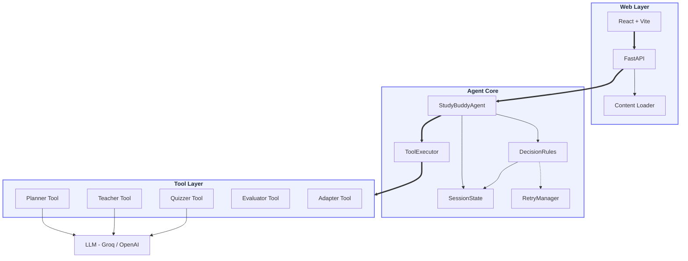

# EZ Agentic Study Buddy

[](https://github.com/ebinzacharias/ez-agentic-study-buddy/actions/workflows/ci.yml)
[](https://www.python.org/downloads/)
[](./LICENSE)

An upload-first AI study assistant. Upload course materials (PDF, Markdown, text, JSON), and the system generates adaptive learning paths, teaches concepts, creates quizzes, and adjusts difficulty based on performance.

Built to demonstrate practical agentic AI patterns: ReAct loops, rule-based decision making, tool orchestration, retry mechanisms, and difficulty adaptation.



## Features

- Upload a file, get a study session. Topic is auto-suggested from content.
- Planner breaks material into ordered concepts at the appropriate difficulty.
- Teacher generates explanations grounded in uploaded content, with retry support.
- Quizzer creates multiple-choice questions sourced from the material.
- Evaluator scores answers using rule-based logic (not LLM judgment).
- Adapter adjusts difficulty up or down based on quiz performance.
- DecisionRules engine determines the next action after each step.
- Pydantic-based state tracks progress, scores, retries, and session flow.
- Parses `.txt`, `.md`, `.json`, and `.pdf` (via PyMuPDF).

## Tech Stack

| Layer | Technology |
|-------|------------|
| Backend | Python 3.11+, FastAPI, Pydantic |
| Agent Core | LangChain, LCEL chains, ReAct pattern |
| LLM | Groq (default) or OpenAI |
| Frontend | React, Vite |
| Package Manager | uv |
| CI | GitHub Actions (ruff, mypy, pytest) |

## How It Works

1. User uploads a file through the React frontend.
2. FastAPI backend parses the file and creates a session with an auto-suggested topic.
3. Planner tool generates an ordered learning path from the content.
4. Teacher tool explains each concept at the current difficulty level.
5. Quizzer tool generates multiple-choice questions for the concept.
6. Evaluator tool scores answers using explicit keyword matching.
7. Adapter tool adjusts difficulty based on quiz performance and retry count.
8. DecisionRules determines the next step. The loop repeats until all concepts are mastered.

## Architecture


```mermaid
flowchart TD
    classDef layer fill:#EEF2FF,stroke:#6366F1,stroke-width:2px,color:#1E293B,font-weight:bold

    subgraph Web[Web Layer]
        direction TB
        UI[React + Vite]
        API[FastAPI]
        CL[Content Loader]
    end

    subgraph Agent[Agent Core]
        direction TB
        SA[StudyBuddyAgent]
        TE[ToolExecutor]
        DR[DecisionRules]
        SM[SessionState]
        RM[RetryManager]
    end

    subgraph Tools[Tool Layer]
        direction TB
        PT[Planner Tool]
        TT[Teacher Tool]
        QT[Quizzer Tool]
        ET[Evaluator Tool]
        AT[Adapter Tool]
    end

    LLM[LLM - Groq / OpenAI]

    UI ==> API
    API --> CL
    API ==> SA
    SA --> DR
    SA --> SM
    DR --> SM
    DR -.-> RM
    SA ==> TE
    TE ==> Tools
    PT --> LLM
    TT --> LLM
    QT --> LLM

    class Web,Agent,Tools layer
```

See [ARCHITECTURE.md](./ARCHITECTURE.md) for component details, class diagrams, and data flow.

## Project Structure

```
agent/
  core/       State, decision rules, retry manager, quiz workflow, tool executor
  chains/     LCEL chain composition (observe, decide, act)
  tools/      Planner, Teacher, Quizzer, Evaluator, Adapter
  utils/      LLM client, content loader
webapi/
  main.py     FastAPI backend - sessions, upload, plan, teach, quiz, evaluate
webui/
  src/        React frontend (Vite)
    components/   UploadStep, PlanStep, TeachStep, QuizStep, ModeSwitcher,
                  SessionControls, QuizProgressTracker, MaterialPreview, SourcePreviewModal
scripts/      19 pytest test files
LEARNINGS/    Implementation notes and agentic AI concepts
```

## API Endpoints

| Method | Path | Description |
|--------|------|-------------|
| `POST` | `/upload` | Upload and parse a file |
| `POST` | `/session/from-upload` | Upload file, create session with auto-suggested topic |
| `POST` | `/session` | Create session from previously uploaded content |
| `GET`  | `/session/{id}` | Get session state |
| `POST` | `/session/{id}/plan` | Generate learning path |
| `POST` | `/session/{id}/teach` | Teach a concept |
| `POST` | `/session/{id}/quiz` | Generate a quiz |
| `POST` | `/session/{id}/evaluate` | Evaluate quiz answers |
| `GET`  | `/session/{id}/next-action` | Get recommended next step |

## Getting Started

Requirements: Python 3.11+, [uv](https://github.com/astral-sh/uv), Node.js 18+, Groq API key ([console.groq.com](https://console.groq.com)).

```bash
git clone https://github.com/ebinzacharias/ez-agentic-study-buddy.git
cd ez-agentic-study-buddy
uv sync --extra web --locked

cp .env.example .env
# Add your GROQ_API_KEY to .env

# Verify
uv run python -m pytest scripts/test_decision_rules.py -q
```

Run the app:

```bash
# Backend
python -m uvicorn webapi.main:app --reload --port 8000

# Frontend
cd webui && npm install && npm run dev
```

Open [http://localhost:5173](http://localhost:5173).

Programmatic usage:

```python
from agent.core.agent import StudyBuddyAgent

agent = StudyBuddyAgent(topic="Python Basics", max_iterations=50)
result = agent.run()
print(f"Progress: {result['progress_percentage']:.1f}%")
```

## Testing

```bash
# Full suite (requires GROQ_API_KEY)
uv run python -m pytest -q

# Offline only
uv run python -m pytest scripts/test_decision_rules.py scripts/test_quizzer_schema_validation.py -q
```

Tests requiring `GROQ_API_KEY` skip automatically in CI.

## Security

Never commit `.env` or API keys. If a key is exposed in git history, rotate it immediately.

## Documentation

- [Usage Guide](./USAGE.md) - Configuration, usage patterns, troubleshooting
- [Architecture](./ARCHITECTURE.md) - System design, diagrams, design decisions
- [Changelog](./CHANGELOG.md) - Version history

## Build Journal

The [`LEARNINGS/`](./LEARNINGS/) folder contains a 16-step engineering journal documenting each architectural decision made while building this system — from state management design through LCEL refactoring to edge case testing.

It also includes 12 concept reference notes covering agentic frameworks (CrewAI, LangGraph, AG2, BeeAI), reflection agents, and AI system design patterns studied during the [Building AI Agents and Agentic Workflows](https://coursera.org/share/e87f3ed45cbdbf2fa231d9287dd96f50) specialization on Coursera.

| Step | Topic | Step | Topic |
|------|-------|------|-------|
| 1 | State management | 9 | Evaluator tool |
| 2 | LLM client setup | 10 | Quiz workflow |
| 3 | Core agent skeleton | 11 | Decision rules |
| 4 | Planner tool | 12 | ReAct loop |
| 5 | Manual tool calling | 13 | Adapter tool |
| 6 | Teacher tool | 14 | Retry mechanisms |
| 7 | State updates | 15 | LCEL refactoring |
| 8 | Quizzer tool | 16 | Testing and edge cases |

## License

[MIT License](./LICENSE). See [THIRD_PARTY_NOTICES.md](./THIRD_PARTY_NOTICES.md) for adapted third-party material.
