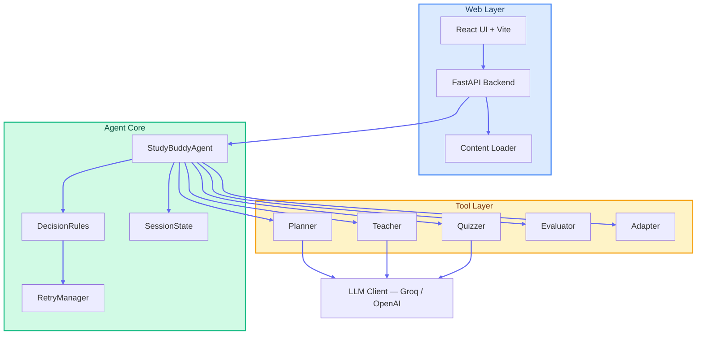

# EZ Agentic Study Buddy

**An Upload-First AI Study Assistant with Adaptive Learning**

**Started:** January 2026

---

## What Is This?

EZ Agentic Study Buddy lets you **upload your own course materials** (PDF, Markdown, plain text, JSON) and immediately get an **AI-powered study session** — adaptive learning paths, concept explanations, multiple-choice quizzes, and feedback — all grounded in *your* content.

It showcases practical **agentic AI patterns**: a ReAct loop, rule-based decision making, tool orchestration, retry mechanisms, and difficulty adaptation.

## Features

| Category | Details |
|----------|---------|
| **Upload-First UX** | Drop a file, get a session. Topic is auto-suggested from content. |
| **Adaptive Learning Paths** | Planner tool breaks material into ordered concepts at the right difficulty. |
| **Concept Teaching** | Teacher tool generates grounded explanations with retry support. |
| **Multiple-Choice Quizzes** | Quizzer tool creates MC questions sourced from uploaded content. |
| **Evaluation & Feedback** | Evaluator tool scores answers with explicit rule-based logic (not LLM judgment). |
| **Difficulty Adaptation** | Adapter tool adjusts difficulty up/down based on quiz performance. |
| **Session State Tracking** | Pydantic-based state tracks progress, scores, retries, and next actions. |
| **Next-Action Guidance** | DecisionRules engine recommends what to do next after each step. |
| **Content Loading** | Parses `.txt`, `.md`, `.json`, and `.pdf` (PyMuPDF is a normal dependency). |
| **Web UI** | React frontend + FastAPI backend for the full upload → plan → teach → quiz → evaluate flow. |
| **Design System** | v2.0.0 tokens (Deep Slate, Electric Indigo, Emerald), glass-morphic cards, Sora + Inter typography. |
| **Agentic Skills** | Copilot agent skills — UI-STYLE-GUARDIAN for design enforcement, REPO-AUDITOR for codebase health. |
| **CI Pipeline** | GitHub Actions with ruff linting, mypy type checking, and pytest. |

## Tech Stack

| Layer | Technology |
|-------|-----------|
| Backend | Python 3.11+, FastAPI, Pydantic |
| Agent Core | LangChain, LCEL chains, ReAct pattern |
| LLM | Groq (default, free) or OpenAI (pluggable) |
| Frontend | React + Vite |
| Package Manager | uv |
| CI | GitHub Actions — ruff, mypy, pytest |

## Quick Start

### Prerequisites

- Python 3.11+
- [uv](https://github.com/astral-sh/uv) package manager
- Node.js 18+ (for the web UI)
- Groq API key — free at [console.groq.com](https://console.groq.com)

### Install & Verify

The repo includes a committed **`uv.lock`** so installs are reproducible. Use `--locked` to ensure your environment matches that file (CI does this).

```bash
# Clone & install (includes FastAPI backend)
git clone https://github.com/ebinzacharias/ez-agentic-study-buddy.git
cd ez-agentic-study-buddy
uv sync --extra web --locked

# Configure environment
cp .env.example .env
# Edit .env → add your GROQ_API_KEY (never commit .env — see Security below)

# Run offline tests to verify
uv run python -m pytest scripts/test_decision_rules.py -q
```

### Run the Web App

**Backend (FastAPI):**

```bash
python -m uvicorn webapi.main:app --reload --port 8000
```

**Frontend (React):**

```bash
cd webui
npm install
npm run dev
```

Open [http://localhost:5173](http://localhost:5173), upload a file, and start studying.

### Programmatic Usage

```python
from agent.core.agent import StudyBuddyAgent

agent = StudyBuddyAgent(topic="Python Basics", max_iterations=50)
result = agent.run()

print(f"Concepts taught: {result['concepts_taught']}")
print(f"Progress: {result['progress_percentage']:.1f}%")
```

See [USAGE.md](USAGE.md) for the full usage guide.

## Architecture Overview


```mermaid
flowchart TD
    style WebLayer fill:#DBEAFE,stroke:#3B82F6,stroke-width:2px,color:#1E3A5F
    style AgentCore fill:#D1FAE5,stroke:#10B981,stroke-width:2px,color:#064E3B
    style ToolLayer fill:#FEF3C7,stroke:#F59E0B,stroke-width:2px,color:#78350F

    linkStyle default stroke:#6366F1,stroke-width:2px

    subgraph WebLayer[Web Layer]
        UI[React UI + Vite]
        API[FastAPI Backend]
        CL[Content Loader]
    end

    subgraph AgentCore[Agent Core]
        SA[StudyBuddyAgent]
        DR[DecisionRules]
        SM[SessionState]
        RM[RetryManager]
    end

    subgraph ToolLayer[Tool Layer]
        PT[Planner]
        TT[Teacher]
        QT[Quizzer]
        ET[Evaluator]
        AT[Adapter]
    end

    LLM[LLM Client — Groq / OpenAI]

    UI --> API
    API --> CL
    API --> SA
    SA --> DR
    SA --> SM
    DR --> RM
    SA --> PT
    SA --> TT
    SA --> QT
    SA --> ET
    SA --> AT
    PT --> LLM
    TT --> LLM
    QT --> LLM
```

For detailed architecture, component diagrams, and data flow, see [ARCHITECTURE.md](./ARCHITECTURE.md).

## Project Structure

```
agent/
  core/           # Agent, state, decision rules, retry manager, quiz workflow, tool executor
  chains/         # LCEL chain composition (observe → decide → act)
  tools/          # Planner, Teacher, Quizzer, Evaluator, Adapter
  agents/         # Agent classes (Planner, Teacher, Quizzer, Adapter)
  utils/          # LLM client, content loader
webapi/
  main.py         # FastAPI backend — sessions, upload, plan, teach, quiz, evaluate
webui/
  src/            # React frontend (Vite)
    components/   # LandingHero, UploadStep, PlanStep, TeachStep, QuizStep, SessionControls
    style.css     # Design tokens, animations, responsive breakpoints
.github/
  copilot-agents/ # Agentic skills for Copilot
    UI-STYLE-GUARDIAN/   # Design system enforcement (SKILL.md, design-tokens.json, components-reference.md)
    REPO-AUDITOR/        # Codebase audit & cleanup (SKILL.md, audit-checklist.md)
scripts/          # Pytest test suite (19 test files)
LEARNINGS/        # Step-by-step implementation notes & agentic AI concepts
```

## API Endpoints

| Method | Path | Description |
|--------|------|-------------|
| `POST` | `/upload` | Upload & parse a single file |
| `POST` | `/session/from-upload` | Upload file(s) → create session with auto-suggested topic |
| `POST` | `/session` | Create a session from already-uploaded content |
| `GET`  | `/session/{id}` | Get session state |
| `POST` | `/session/{id}/upload` | Upload additional file to existing session |
| `POST` | `/session/{id}/plan` | Generate learning path |
| `POST` | `/session/{id}/teach` | Teach a concept |
| `POST` | `/session/{id}/quiz` | Generate a quiz |
| `POST` | `/session/{id}/evaluate` | Evaluate quiz answers |
| `GET`  | `/session/{id}/next-action` | Get recommended next step |

## Security

- **Never commit `.env`** or paste real **Groq**, **OpenAI**, or other API keys into the repo, issues, or screenshots. Only use `.env.example` (placeholders) in version control.
- If a key was ever exposed in git history or a public fork, **rotate it immediately** in the provider console and treat it as compromised.

## Testing

```bash
# Full test suite (requires GROQ_API_KEY for LLM tests)
uv run python -m pytest -q

# Offline-only tests (no API key needed)
uv run python -m pytest scripts/test_decision_rules.py scripts/test_quizzer_schema_validation.py -q
```

Tests that require `GROQ_API_KEY` skip automatically in CI.

## Documentation

- [Usage Guide](./USAGE.md) — Detailed usage, configuration, and troubleshooting
- [Architecture](./ARCHITECTURE.md) — System design, diagrams, and design patterns
- [Changelog](./CHANGELOG.md) — Version history
- [Learning Notes](./LEARNINGS/) — Step-by-step implementation journey & agentic AI concepts

## License

This project is released under the [MIT License](./LICENSE). You may use, modify, and redistribute the code under those terms. If you publish a fork or portfolio copy, linking back or crediting this repository is appreciated but not required. Ideas, bug reports, and pull requests are welcome when maintainers have time to review them.

For notices on adapted third-party material (not the license for the whole repo), see [THIRD_PARTY_NOTICES.md](./THIRD_PARTY_NOTICES.md).
